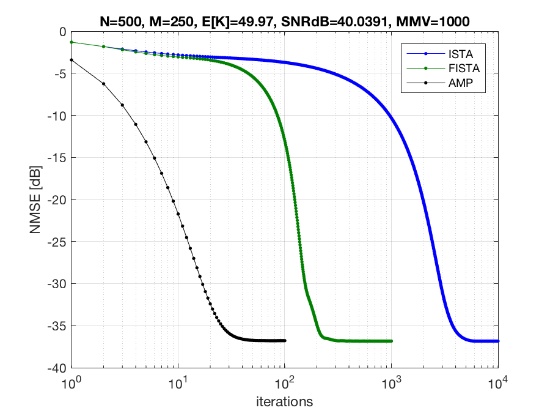
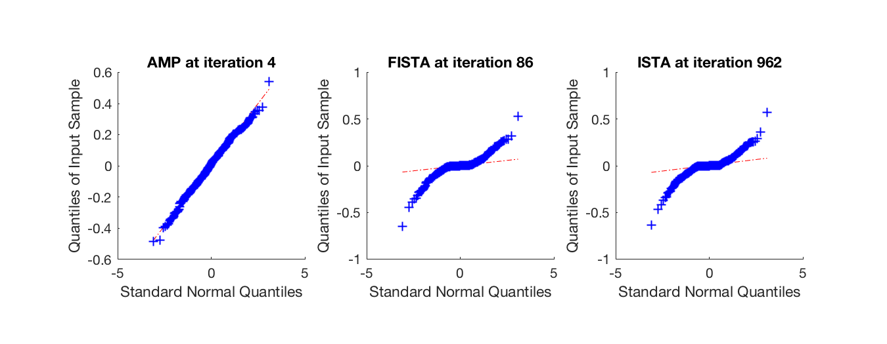

# What is this?

This project contains scripts to reproduce experiments from the paper
[AMP-Inspired Deep Networks for Sparse Linear Inverse Problems](http://ieeexplore.ieee.org/document/7934066/)
by 
[Mark Borgerding](mailto://borgerding.7@osu.edu)
,
[Phil](mailto://schniter.1@osu.edu)
[Schniter](http://www2.ece.ohio-state.edu/~schniter)
, and [Sundeep Rangan](http://engineering.nyu.edu/people/sundeep-rangan).
To appear in IEEE Transactions on Signal Processing.
See also the related [preprint](https://arxiv.org/pdf/1612.01183)

# The Problem of Interest

Briefly, the _Sparse Linear Inverse Problem_ is the estimation of an unknown signal from indirect, noisy, underdetermined measurements by exploiting the knowledge that the signal has many zeros.  We compare various iterative algorithmic approaches to this problem and explore how they benefit from loop-unrolling and deep learning.

# Overview

The included scripts 
- are generally written in python and require [TensorFlow](http://www.tensorflow.org),
- work best with a GPU,
- generate synthetic data as needed,
- are known to work with CentOS 7 Linux and TensorfFlow 1.1,
- are sometimes be written in octave/matlab .m files.

##  If you are just looking for an implementation of VAMP ...

You might prefer the Matlab code in [GAMP](https://sourceforge.net/projects/gampmatlab/)/code/VAMP/ 
or the python code in [Vampyre](https://github.com/GAMPTeam/vampyre).

# Description of Files

## [save_problem.py](save_problem.py) 

Creates numpy archives (.npz) and matlab (.mat) files with (y,x,A) for the sparse linear problem y=Ax+w.
These files are not really necessary for any of the deep-learning scripts, which generate the problem on demand.
They are merely provided for better understanding the specific realizations used in the experiments.

```
$ python3 save_problem.py
saving problem_Giid.mat,problem_Giid.npz norm(x)=224.5516663 norm(y)=224.0477230
saving problem_k15.mat,problem_k15.npz norm(x)=224.4524994 norm(y)=224.3352588
saving problem_k100.mat,problem_k100.npz norm(x)=224.2500458 norm(y)=224.0362651
saving problem_rap1.mat,problem_rap1.npz norm(x)=276.4882507 norm(y)=289.9351196
saving problem_rap2.mat,problem_rap2.npz norm(x)=89.6196136 norm(y)=90.3195496
```

## [ista_fista_amp.m](ista_fista_amp.m)

Using the .mat files created by save_problem.py, this octave/matlab script tests the performance of non-learned algorithms ISTA, FISTA, and AMP.

e.g.
```
>> ista_fista_amp
loaded Gaussian A problem
AMP reached NMSE=-35dB at iteration 26
AMP terminal NMSE=-36.7865 dB
FISTA reached NMSE=-35dB at iteration 202
FISTA terminal NMSE=-36.8365 dB
ISTA reached NMSE=-35dB at iteration 3754
ISTA terminal NMSE=-36.8367 dB
```






## [LISTA.py](LISTA.py)

This is an example implementation of LISTA _Learned Iterative Soft Thresholding Algorithm_ by (Gregor&LeCun, 2010 ICML).

```
$ python LISTA.py 
norms xval:224.5516510 yval:224.0477230
Linear trainrate=0.5 fine tuning all B_0:0,S_0:0,lam_0:0,lam_1:0,lam_2:0,lam_3:0,lam_4:0,lam_5:0
i=0      nmse=-1.295706 dB (best=-1.295706)
i=1000   nmse=-2.978656 dB (best=-2.978656)
i=2000   nmse=-2.979118 dB (best=-2.980402)
i=3000   nmse=-2.977585 dB (best=-2.981049)
i=4000   nmse=-2.977192 dB (best=-2.981049)
i=5000   nmse=-2.978181 dB (best=-2.981049)
i=6000   nmse=-2.976449 dB (best=-2.981049)
i=7000   nmse=-2.977701 dB (best=-2.981049)
i=8000   nmse=-2.975074 dB (best=-2.981049)
Linear trainrate=0.1 fine tuning all B_0:0,S_0:0,lam_0:0,lam_1:0,lam_2:0,lam_3:0,lam_4:0,lam_5:0
i=0      nmse=-2.975074 dB (best=-2.975074)
i=1000   nmse=-2.990523 dB (best=-2.991508)
i=2000   nmse=-2.990486 dB (best=-2.992042)
i=3000   nmse=-2.989711 dB (best=-2.992042)
i=4000   nmse=-2.991351 dB (best=-2.992042)
i=5000   nmse=-2.990159 dB (best=-2.992403)
i=6000   nmse=-2.991431 dB (best=-2.992403)
i=7000   nmse=-2.991723 dB (best=-2.992403)
i=8000   nmse=-2.989994 dB (best=-2.992403)
i=9000   nmse=-2.990943 dB (best=-2.992403)
i=10000  nmse=-2.991525 dB (best=-2.992403)
Linear trainrate=0.01 fine tuning all B_0:0,S_0:0,lam_0:0,lam_1:0,lam_2:0,lam_3:0,lam_4:0,lam_5:0
i=0      nmse=-2.991525 dB (best=-2.991525)
i=1000   nmse=-2.993356 dB (best=-2.993408)
i=2000   nmse=-2.993673 dB (best=-2.993744)
i=3000   nmse=-2.993981 dB (best=-2.993981)
i=4000   nmse=-2.993938 dB (best=-2.994000)
i=5000   nmse=-2.993856 dB (best=-2.994000)
i=6000   nmse=-2.994006 dB (best=-2.994185)
i=7000   nmse=-2.994032 dB (best=-2.994185)
i=8000   nmse=-2.994238 dB (best=-2.994418)
i=9000   nmse=-2.994047 dB (best=-2.994418)
i=10000  nmse=-2.994208 dB (best=-2.994418)
i=11000  nmse=-2.994128 dB (best=-2.994418)
i=12000  nmse=-2.994221 dB (best=-2.994418)
i=13000  nmse=-2.994485 dB (best=-2.994515)
i=14000  nmse=-2.994253 dB (best=-2.994524)
i=15000  nmse=-2.994328 dB (best=-2.994679)
i=16000  nmse=-2.994405 dB (best=-2.994679)
i=17000  nmse=-2.994601 dB (best=-2.994679)
i=18000  nmse=-2.994339 dB (best=-2.994679)
i=19000  nmse=-2.994339 dB (best=-2.994679)
i=20000  nmse=-2.994187 dB (best=-2.994679)
LISTA T=1 extending lam_0:0
i=0      nmse=-3.678087 dB (best=-3.678087)
i=1000   nmse=-3.679837 dB (best=-3.679851)
i=2000   nmse=-3.679848 dB (best=-3.679851)
i=3000   nmse=-3.679848 dB (best=-3.679851)
i=4000   nmse=-3.679823 dB (best=-3.679851)
i=5000   nmse=-3.679851 dB (best=-3.679851)
i=6000   nmse=-3.679821 dB (best=-3.679851)
LISTA T=1 trainrate=0.5 fine tuning all B_0:0,S_0:0,lam_0:0,lam_1:0,lam_2:0,lam_3:0,lam_4:0,lam_5:0
i=0      nmse=-3.679821 dB (best=-3.679821)
i=1000   nmse=-6.143229 dB (best=-6.143229)
i=2000   nmse=-6.360985 dB (best=-6.360985)
i=3000   nmse=-6.386578 dB (best=-6.386578)
i=4000   nmse=-6.388455 dB (best=-6.391043)
i=5000   nmse=-6.387405 dB (best=-6.392977)
i=6000   nmse=-6.391533 dB (best=-6.393390)
i=7000   nmse=-6.388214 dB (best=-6.396033)
i=8000   nmse=-6.387995 dB (best=-6.396033)
i=9000   nmse=-6.388549 dB (best=-6.396033)
i=10000  nmse=-6.390011 dB (best=-6.396033)
i=11000  nmse=-6.392407 dB (best=-6.396033)
i=12000  nmse=-6.388993 dB (best=-6.396033)
LISTA T=1 trainrate=0.1 fine tuning all B_0:0,S_0:0,lam_0:0,lam_1:0,lam_2:0,lam_3:0,lam_4:0,lam_5:0
i=0      nmse=-6.388993 dB (best=-6.388993)
i=1000   nmse=-6.405227 dB (best=-6.405264)
i=2000   nmse=-6.405815 dB (best=-6.406590)
i=3000   nmse=-6.406335 dB (best=-6.408056)
i=4000   nmse=-6.406373 dB (best=-6.408601)
i=5000   nmse=-6.407241 dB (best=-6.408601)
i=6000   nmse=-6.406947 dB (best=-6.408601)
i=7000   nmse=-6.405915 dB (best=-6.408601)
i=8000   nmse=-6.407546 dB (best=-6.408601)
i=9000   nmse=-6.405352 dB (best=-6.408601)
LISTA T=1 trainrate=0.01 fine tuning all B_0:0,S_0:0,lam_0:0,lam_1:0,lam_2:0,lam_3:0,lam_4:0,lam_5:0
i=0      nmse=-6.405352 dB (best=-6.405352)
i=1000   nmse=-6.406999 dB (best=-6.406999)
i=2000   nmse=-6.408278 dB (best=-6.408278)
i=3000   nmse=-6.409042 dB (best=-6.409042)
i=4000   nmse=-6.409610 dB (best=-6.409665)
i=5000   nmse=-6.409904 dB (best=-6.409963)
i=6000   nmse=-6.410212 dB (best=-6.410276)
i=7000   nmse=-6.410766 dB (best=-6.410766)
i=8000   nmse=-6.410609 dB (best=-6.410862)
i=9000   nmse=-6.410803 dB (best=-6.410868)
i=10000  nmse=-6.410927 dB (best=-6.411133)
i=11000  nmse=-6.411018 dB (best=-6.411149)
i=12000  nmse=-6.410999 dB (best=-6.411149)
i=13000  nmse=-6.411237 dB (best=-6.411236)
i=14000  nmse=-6.411270 dB (best=-6.411353)
i=15000  nmse=-6.411462 dB (best=-6.411462)
i=16000  nmse=-6.411371 dB (best=-6.411601)
i=17000  nmse=-6.411231 dB (best=-6.411601)
i=18000  nmse=-6.411111 dB (best=-6.411601)
i=19000  nmse=-6.411225 dB (best=-6.411601)
i=20000  nmse=-6.411146 dB (best=-6.411601)
i=21000  nmse=-6.411213 dB (best=-6.411601)
LISTA T=2 extending lam_1:0
i=0      nmse=2.815641 dB (best=2.815641)
i=1000   nmse=-2.282928 dB (best=-2.282928)
i=2000   nmse=-3.765755 dB (best=-3.765755)
i=3000   nmse=-4.176616 dB (best=-4.176616)
i=4000   nmse=-4.251509 dB (best=-4.251509)
i=5000   nmse=-4.255618 dB (best=-4.255820)
i=6000   nmse=-4.255032 dB (best=-4.255820)
i=7000   nmse=-4.254972 dB (best=-4.255820)
i=8000   nmse=-4.254987 dB (best=-4.255820)
i=9000   nmse=-4.254854 dB (best=-4.255820)
i=10000  nmse=-4.255017 dB (best=-4.255820)
LISTA T=2 trainrate=0.5 fine tuning all B_0:0,S_0:0,lam_0:0,lam_1:0,lam_2:0,lam_3:0,lam_4:0,lam_5:0
i=0      nmse=-4.255017 dB (best=-4.255017)
i=1000   nmse=-6.825531 dB (best=-6.825531)
i=2000   nmse=-9.571950 dB (best=-9.571950)
i=3000   nmse=-11.000087 dB (best=-11.000088)
i=4000   nmse=-11.156223 dB (best=-11.156223)
i=5000   nmse=-11.234140 dB (best=-11.245314)
i=6000   nmse=-11.302651 dB (best=-11.302651)
i=7000   nmse=-11.337249 dB (best=-11.352076)
i=8000   nmse=-11.366589 dB (best=-11.366589)
i=9000   nmse=-11.374066 dB (best=-11.386651)
i=10000  nmse=-11.384757 dB (best=-11.391203)
i=11000  nmse=-11.378998 dB (best=-11.398867)
i=12000  nmse=-11.392558 dB (best=-11.399878)
i=13000  nmse=-11.382673 dB (best=-11.406742)
i=14000  nmse=-11.391981 dB (best=-11.406742)
i=15000  nmse=-11.405396 dB (best=-11.408226)
i=16000  nmse=-11.389142 dB (best=-11.413436)
i=17000  nmse=-11.393719 dB (best=-11.413436)
i=18000  nmse=-11.389047 dB (best=-11.413436)
i=19000  nmse=-11.394378 dB (best=-11.413436)
i=20000  nmse=-11.399170 dB (best=-11.413436)
i=21000  nmse=-11.390210 dB (best=-11.413436)
LISTA T=2 trainrate=0.1 fine tuning all B_0:0,S_0:0,lam_0:0,lam_1:0,lam_2:0,lam_3:0,lam_4:0,lam_5:0
i=0      nmse=-11.390210 dB (best=-11.390210)
i=1000   nmse=-11.481429 dB (best=-11.483165)
i=2000   nmse=-11.487813 dB (best=-11.489386)
i=3000   nmse=-11.486307 dB (best=-11.493517)
i=4000   nmse=-11.489860 dB (best=-11.493517)
i=5000   nmse=-11.490422 dB (best=-11.493688)
i=6000   nmse=-11.488150 dB (best=-11.493688)
i=7000   nmse=-11.479529 dB (best=-11.493688)
i=8000   nmse=-11.485313 dB (best=-11.493688)
i=9000   nmse=-11.486683 dB (best=-11.493688)
i=10000  nmse=-11.490084 dB (best=-11.495165)
i=11000  nmse=-11.479270 dB (best=-11.495165)
i=12000  nmse=-11.490300 dB (best=-11.495165)
i=13000  nmse=-11.491095 dB (best=-11.496396)
i=14000  nmse=-11.488986 dB (best=-11.496396)
i=15000  nmse=-11.492862 dB (best=-11.496396)
i=16000  nmse=-11.485879 dB (best=-11.496396)
i=17000  nmse=-11.489718 dB (best=-11.496396)
i=18000  nmse=-11.489605 dB (best=-11.496396)
LISTA T=2 trainrate=0.01 fine tuning all B_0:0,S_0:0,lam_0:0,lam_1:0,lam_2:0,lam_3:0,lam_4:0,lam_5:0
i=0      nmse=-11.489605 dB (best=-11.489605)
i=1000   nmse=-11.500024 dB (best=-11.500023)
i=2000   nmse=-11.503768 dB (best=-11.503768)
i=3000   nmse=-11.505711 dB (best=-11.506657)
i=4000   nmse=-11.506758 dB (best=-11.506853)
i=5000   nmse=-11.507987 dB (best=-11.508021)
i=6000   nmse=-11.509105 dB (best=-11.509460)
i=7000   nmse=-11.508684 dB (best=-11.509460)
i=8000   nmse=-11.508490 dB (best=-11.509461)
i=9000   nmse=-11.508588 dB (best=-11.509634)
i=10000  nmse=-11.508828 dB (best=-11.509634)
i=11000  nmse=-11.508963 dB (best=-11.509634)
i=12000  nmse=-11.509893 dB (best=-11.509893)
i=13000  nmse=-11.511170 dB (best=-11.511170)
i=14000  nmse=-11.509981 dB (best=-11.511439)
i=15000  nmse=-11.509600 dB (best=-11.511439)
i=16000  nmse=-11.509181 dB (best=-11.511439)
i=17000  nmse=-11.508384 dB (best=-11.511439)
i=18000  nmse=-11.507735 dB (best=-11.511439)
i=19000  nmse=-11.508274 dB (best=-11.511439)
LISTA T=3 extending lam_2:0
i=0      nmse=-5.825481 dB (best=-5.825482)
i=1000   nmse=-9.813716 dB (best=-9.813716)
i=2000   nmse=-9.816023 dB (best=-9.816034)
i=3000   nmse=-9.816021 dB (best=-9.816034)
i=4000   nmse=-9.816017 dB (best=-9.816034)
i=5000   nmse=-9.816024 dB (best=-9.816034)
i=6000   nmse=-9.816030 dB (best=-9.816034)
i=7000   nmse=-9.816018 dB (best=-9.816034)
LISTA T=3 trainrate=0.5 fine tuning all B_0:0,S_0:0,lam_0:0,lam_1:0,lam_2:0,lam_3:0,lam_4:0,lam_5:0
i=0      nmse=-9.816018 dB (best=-9.816018)
i=1000   nmse=-14.083040 dB (best=-14.089805)
i=2000   nmse=-14.262290 dB (best=-14.263415)
i=3000   nmse=-14.351339 dB (best=-14.352772)
i=4000   nmse=-14.367601 dB (best=-14.383436)
i=5000   nmse=-14.394972 dB (best=-14.405580)
i=6000   nmse=-14.408193 dB (best=-14.410375)
i=7000   nmse=-14.398428 dB (best=-14.419014)
i=8000   nmse=-14.422532 dB (best=-14.427329)
i=9000   nmse=-14.389062 dB (best=-14.427329)
i=10000  nmse=-14.394209 dB (best=-14.427329)
i=11000  nmse=-14.410884 dB (best=-14.427329)
i=12000  nmse=-14.410186 dB (best=-14.427329)
i=13000  nmse=-14.416312 dB (best=-14.429248)
i=14000  nmse=-14.417455 dB (best=-14.429757)
i=15000  nmse=-14.401765 dB (best=-14.429757)
i=16000  nmse=-14.398332 dB (best=-14.429757)
i=17000  nmse=-14.400302 dB (best=-14.429757)
i=18000  nmse=-14.390738 dB (best=-14.429757)
i=19000  nmse=-14.424274 dB (best=-14.435135)
i=20000  nmse=-14.407024 dB (best=-14.435135)
i=21000  nmse=-14.415981 dB (best=-14.435135)
i=22000  nmse=-14.369830 dB (best=-14.435135)
i=23000  nmse=-14.398458 dB (best=-14.435135)
i=24000  nmse=-14.409600 dB (best=-14.435135)
LISTA T=3 trainrate=0.1 fine tuning all B_0:0,S_0:0,lam_0:0,lam_1:0,lam_2:0,lam_3:0,lam_4:0,lam_5:0
i=0      nmse=-14.409600 dB (best=-14.409601)
i=1000   nmse=-14.601861 dB (best=-14.610094)
i=2000   nmse=-14.612112 dB (best=-14.619740)
i=3000   nmse=-14.607580 dB (best=-14.619740)
i=4000   nmse=-14.605111 dB (best=-14.619740)
i=5000   nmse=-14.601336 dB (best=-14.619740)
i=6000   nmse=-14.606397 dB (best=-14.619740)
i=7000   nmse=-14.605229 dB (best=-14.619740)
LISTA T=3 trainrate=0.01 fine tuning all B_0:0,S_0:0,lam_0:0,lam_1:0,lam_2:0,lam_3:0,lam_4:0,lam_5:0
i=0      nmse=-14.605229 dB (best=-14.605228)
i=1000   nmse=-14.637463 dB (best=-14.637464)
i=2000   nmse=-14.643615 dB (best=-14.644059)
i=3000   nmse=-14.650302 dB (best=-14.650302)
i=4000   nmse=-14.650685 dB (best=-14.651823)
i=5000   nmse=-14.652174 dB (best=-14.652901)
i=6000   nmse=-14.650363 dB (best=-14.652901)
i=7000   nmse=-14.654099 dB (best=-14.654294)
i=8000   nmse=-14.654527 dB (best=-14.655034)
i=9000   nmse=-14.654653 dB (best=-14.655034)
i=10000  nmse=-14.655502 dB (best=-14.655501)
i=11000  nmse=-14.656656 dB (best=-14.656891)
i=12000  nmse=-14.655936 dB (best=-14.657195)
i=13000  nmse=-14.656190 dB (best=-14.657195)
i=14000  nmse=-14.657965 dB (best=-14.658177)
i=15000  nmse=-14.656084 dB (best=-14.658351)
i=16000  nmse=-14.655294 dB (best=-14.658351)
i=17000  nmse=-14.653323 dB (best=-14.658351)
i=18000  nmse=-14.654233 dB (best=-14.658351)
i=19000  nmse=-14.653833 dB (best=-14.658351)
i=20000  nmse=-14.653200 dB (best=-14.658351)
LISTA T=4 extending lam_3:0
i=0      nmse=-12.571206 dB (best=-12.571206)
i=1000   nmse=-13.083762 dB (best=-13.083871)
i=2000   nmse=-13.083782 dB (best=-13.083886)
i=3000   nmse=-13.083868 dB (best=-13.083891)
i=4000   nmse=-13.083812 dB (best=-13.083891)
i=5000   nmse=-13.083787 dB (best=-13.083891)
i=6000   nmse=-13.083525 dB (best=-13.083891)
i=7000   nmse=-13.083661 dB (best=-13.083891)
i=8000   nmse=-13.083868 dB (best=-13.083891)
i=9000   nmse=-13.083730 dB (best=-13.083891)
i=10000  nmse=-13.083568 dB (best=-13.083891)
i=11000  nmse=-13.083565 dB (best=-13.083891)
i=12000  nmse=-13.083783 dB (best=-13.083891)
LISTA T=4 trainrate=0.5 fine tuning all B_0:0,S_0:0,lam_0:0,lam_1:0,lam_2:0,lam_3:0,lam_4:0,lam_5:0
i=0      nmse=-13.083783 dB (best=-13.083784)
i=1000   nmse=-16.955930 dB (best=-16.968576)
i=2000   nmse=-16.970395 dB (best=-17.004757)
i=3000   nmse=-17.067116 dB (best=-17.067117)
i=4000   nmse=-16.994594 dB (best=-17.067117)
i=5000   nmse=-17.026620 dB (best=-17.067117)
i=6000   nmse=-16.962693 dB (best=-17.067117)
i=7000   nmse=-17.021729 dB (best=-17.067117)
i=8000   nmse=-16.997473 dB (best=-17.067117)
i=9000   nmse=-16.984513 dB (best=-17.067117)
LISTA T=4 trainrate=0.1 fine tuning all B_0:0,S_0:0,lam_0:0,lam_1:0,lam_2:0,lam_3:0,lam_4:0,lam_5:0
i=0      nmse=-16.984513 dB (best=-16.984513)
i=1000   nmse=-17.330179 dB (best=-17.346174)
i=2000   nmse=-17.339813 dB (best=-17.351166)
i=3000   nmse=-17.329377 dB (best=-17.351166)
i=4000   nmse=-17.339823 dB (best=-17.357078)
i=5000   nmse=-17.334964 dB (best=-17.357865)
i=6000   nmse=-17.330539 dB (best=-17.357865)
i=7000   nmse=-17.342944 dB (best=-17.357865)
i=8000   nmse=-17.340785 dB (best=-17.357865)
i=9000   nmse=-17.349666 dB (best=-17.357865)
i=10000  nmse=-17.338438 dB (best=-17.357865)
LISTA T=4 trainrate=0.01 fine tuning all B_0:0,S_0:0,lam_0:0,lam_1:0,lam_2:0,lam_3:0,lam_4:0,lam_5:0
i=0      nmse=-17.338438 dB (best=-17.338438)
i=1000   nmse=-17.400519 dB (best=-17.400676)
i=2000   nmse=-17.411553 dB (best=-17.412855)
i=3000   nmse=-17.417825 dB (best=-17.417826)
i=4000   nmse=-17.418836 dB (best=-17.420176)
i=5000   nmse=-17.416502 dB (best=-17.420427)
i=6000   nmse=-17.423451 dB (best=-17.424679)
i=7000   nmse=-17.416817 dB (best=-17.425653)
i=8000   nmse=-17.422128 dB (best=-17.425653)
i=9000   nmse=-17.423766 dB (best=-17.425653)
i=10000  nmse=-17.420039 dB (best=-17.425653)
i=11000  nmse=-17.419932 dB (best=-17.425653)
i=12000  nmse=-17.420735 dB (best=-17.425653)
LISTA T=5 extending lam_4:0
i=0      nmse=-17.475288 dB (best=-17.475288)
i=1000   nmse=-17.536618 dB (best=-17.536687)
i=2000   nmse=-17.536635 dB (best=-17.536689)
i=3000   nmse=-17.536681 dB (best=-17.536689)
i=4000   nmse=-17.536510 dB (best=-17.536689)
i=5000   nmse=-17.536455 dB (best=-17.536689)
i=6000   nmse=-17.536511 dB (best=-17.536689)
i=7000   nmse=-17.536607 dB (best=-17.536689)
LISTA T=5 trainrate=0.5 fine tuning all B_0:0,S_0:0,lam_0:0,lam_1:0,lam_2:0,lam_3:0,lam_4:0,lam_5:0
i=0      nmse=-17.536607 dB (best=-17.536607)
i=1000   nmse=-19.414814 dB (best=-19.505329)
i=2000   nmse=-19.453874 dB (best=-19.505329)
i=3000   nmse=-19.438593 dB (best=-19.513495)
i=4000   nmse=-19.438152 dB (best=-19.513495)
i=5000   nmse=-19.446702 dB (best=-19.513495)
i=6000   nmse=-19.437819 dB (best=-19.513495)
i=7000   nmse=-19.447709 dB (best=-19.513495)
i=8000   nmse=-19.426291 dB (best=-19.513495)
LISTA T=5 trainrate=0.1 fine tuning all B_0:0,S_0:0,lam_0:0,lam_1:0,lam_2:0,lam_3:0,lam_4:0,lam_5:0
i=0      nmse=-19.426291 dB (best=-19.426290)
i=1000   nmse=-19.999832 dB (best=-19.999831)
i=2000   nmse=-19.985374 dB (best=-20.012554)
i=3000   nmse=-19.991257 dB (best=-20.027865)
i=4000   nmse=-19.999701 dB (best=-20.027865)
i=5000   nmse=-20.001900 dB (best=-20.027865)
i=6000   nmse=-20.011096 dB (best=-20.027865)
i=7000   nmse=-20.007813 dB (best=-20.027927)
i=8000   nmse=-20.001535 dB (best=-20.031084)
i=9000   nmse=-20.001183 dB (best=-20.031084)
i=10000  nmse=-19.999759 dB (best=-20.031084)
i=11000  nmse=-19.987308 dB (best=-20.031084)
i=12000  nmse=-19.998591 dB (best=-20.031084)
i=13000  nmse=-19.997168 dB (best=-20.031084)
LISTA T=5 trainrate=0.01 fine tuning all B_0:0,S_0:0,lam_0:0,lam_1:0,lam_2:0,lam_3:0,lam_4:0,lam_5:0
i=0      nmse=-19.997168 dB (best=-19.997168)
i=1000   nmse=-20.119538 dB (best=-20.119538)
i=2000   nmse=-20.133333 dB (best=-20.134353)
i=3000   nmse=-20.142293 dB (best=-20.143895)
i=4000   nmse=-20.136995 dB (best=-20.143895)
i=5000   nmse=-20.135386 dB (best=-20.143895)
i=6000   nmse=-20.133083 dB (best=-20.143895)
i=7000   nmse=-20.136383 dB (best=-20.143895)
i=8000   nmse=-20.134094 dB (best=-20.143895)
LISTA T=6 extending lam_5:0
i=0      nmse=-18.395469 dB (best=-18.395470)
i=1000   nmse=-18.997887 dB (best=-18.997951)
i=2000   nmse=-18.997630 dB (best=-18.997961)
i=3000   nmse=-18.997049 dB (best=-18.997962)
i=4000   nmse=-18.997921 dB (best=-18.997962)
i=5000   nmse=-18.997855 dB (best=-18.997962)
i=6000   nmse=-18.997881 dB (best=-18.997962)
i=7000   nmse=-18.997895 dB (best=-18.997962)
i=8000   nmse=-18.997780 dB (best=-18.997962)
LISTA T=6 trainrate=0.5 fine tuning all B_0:0,S_0:0,lam_0:0,lam_1:0,lam_2:0,lam_3:0,lam_4:0,lam_5:0
i=0      nmse=-18.997780 dB (best=-18.997780)
i=1000   nmse=-21.296265 dB (best=-21.395632)
i=2000   nmse=-21.299195 dB (best=-21.395632)
i=3000   nmse=-21.218281 dB (best=-21.395632)
i=4000   nmse=-21.262178 dB (best=-21.395632)
i=5000   nmse=-21.250138 dB (best=-21.395632)
i=6000   nmse=-21.314480 dB (best=-21.395632)
LISTA T=6 trainrate=0.1 fine tuning all B_0:0,S_0:0,lam_0:0,lam_1:0,lam_2:0,lam_3:0,lam_4:0,lam_5:0
i=0      nmse=-21.314480 dB (best=-21.314480)
i=1000   nmse=-22.063572 dB (best=-22.092929)
i=2000   nmse=-22.087989 dB (best=-22.109940)
i=3000   nmse=-22.076800 dB (best=-22.109940)
i=4000   nmse=-22.065811 dB (best=-22.109940)
i=5000   nmse=-22.068307 dB (best=-22.109940)
i=6000   nmse=-22.068260 dB (best=-22.109940)
i=7000   nmse=-22.082293 dB (best=-22.109940)
LISTA T=6 trainrate=0.01 fine tuning all B_0:0,S_0:0,lam_0:0,lam_1:0,lam_2:0,lam_3:0,lam_4:0,lam_5:0
i=0      nmse=-22.082293 dB (best=-22.082293)
i=1000   nmse=-22.246459 dB (best=-22.246458)
i=2000   nmse=-22.255030 dB (best=-22.261591)
i=3000   nmse=-22.273688 dB (best=-22.274738)
i=4000   nmse=-22.271194 dB (best=-22.275748)
i=5000   nmse=-22.270195 dB (best=-22.275748)
i=6000   nmse=-22.273598 dB (best=-22.279479)
i=7000   nmse=-22.267370 dB (best=-22.279479)
i=8000   nmse=-22.274561 dB (best=-22.279479)
i=9000   nmse=-22.266262 dB (best=-22.279479)
i=10000  nmse=-22.258878 dB (best=-22.279479)
i=11000  nmse=-22.268763 dB (best=-22.279479)
```
## [LAMP.py](LAMP.py)

Example of Learned AMP (LAMP) with a variety of shrinkage functions.

```
$ python LAMP.py 
theta_init=(1, 2.1972245773362196)
norms xval:224.5516510 yval:224.0477230
Linear trainrate=0.5 fine tuning all B_0:0,theta_0:0,theta_1:0,theta_2:0,theta_3:0,theta_4:0,theta_5:0
i=0      nmse=-1.295706 dB (best=-1.295706)
i=1000   nmse=-2.978656 dB (best=-2.978656)
i=2000   nmse=-2.979118 dB (best=-2.980402)
i=3000   nmse=-2.977585 dB (best=-2.981049)
i=4000   nmse=-2.977192 dB (best=-2.981049)
i=5000   nmse=-2.978181 dB (best=-2.981049)
i=6000   nmse=-2.976449 dB (best=-2.981049)
i=7000   nmse=-2.977701 dB (best=-2.981049)
i=8000   nmse=-2.975074 dB (best=-2.981049)
Linear trainrate=0.1 fine tuning all B_0:0,theta_0:0,theta_1:0,theta_2:0,theta_3:0,theta_4:0,theta_5:0
i=0      nmse=-2.975074 dB (best=-2.975074)
i=1000   nmse=-2.990523 dB (best=-2.991508)
i=2000   nmse=-2.990486 dB (best=-2.992042)
i=3000   nmse=-2.989711 dB (best=-2.992042)
i=4000   nmse=-2.991351 dB (best=-2.992042)
i=5000   nmse=-2.990159 dB (best=-2.992403)
i=6000   nmse=-2.991431 dB (best=-2.992403)
i=7000   nmse=-2.991723 dB (best=-2.992403)
i=8000   nmse=-2.989994 dB (best=-2.992403)
i=9000   nmse=-2.990943 dB (best=-2.992403)
i=10000  nmse=-2.991525 dB (best=-2.992403)
Linear trainrate=0.01 fine tuning all B_0:0,theta_0:0,theta_1:0,theta_2:0,theta_3:0,theta_4:0,theta_5:0
i=0      nmse=-2.991525 dB (best=-2.991525)
i=1000   nmse=-2.993356 dB (best=-2.993408)
i=2000   nmse=-2.993673 dB (best=-2.993744)
i=3000   nmse=-2.993981 dB (best=-2.993981)
i=4000   nmse=-2.993938 dB (best=-2.994000)
i=5000   nmse=-2.993856 dB (best=-2.994000)
i=6000   nmse=-2.994006 dB (best=-2.994185)
i=7000   nmse=-2.994032 dB (best=-2.994185)
i=8000   nmse=-2.994238 dB (best=-2.994418)
i=9000   nmse=-2.994047 dB (best=-2.994418)
i=10000  nmse=-2.994208 dB (best=-2.994418)
i=11000  nmse=-2.994128 dB (best=-2.994418)
i=12000  nmse=-2.994221 dB (best=-2.994418)
i=13000  nmse=-2.994485 dB (best=-2.994515)
i=14000  nmse=-2.994253 dB (best=-2.994524)
i=15000  nmse=-2.994328 dB (best=-2.994679)
i=16000  nmse=-2.994405 dB (best=-2.994679)
i=17000  nmse=-2.994601 dB (best=-2.994679)
i=18000  nmse=-2.994339 dB (best=-2.994679)
i=19000  nmse=-2.994339 dB (best=-2.994679)
i=20000  nmse=-2.994187 dB (best=-2.994679)
LAMP-bg T=1 extending theta_0:0
i=0      nmse=-0.827576 dB (best=-0.827576)
i=1000   nmse=-1.503828 dB (best=-1.503828)
i=2000   nmse=-2.338255 dB (best=-2.338255)
i=3000   nmse=-2.954309 dB (best=-2.954309)
i=4000   nmse=-3.253798 dB (best=-3.253798)
i=5000   nmse=-3.370890 dB (best=-3.370890)
i=6000   nmse=-3.413868 dB (best=-3.413868)
i=7000   nmse=-3.433152 dB (best=-3.433152)
i=8000   nmse=-3.445315 dB (best=-3.445315)
i=9000   nmse=-3.454511 dB (best=-3.454511)
i=10000  nmse=-3.461962 dB (best=-3.461962)
i=11000  nmse=-3.468215 dB (best=-3.468216)
i=12000  nmse=-3.473565 dB (best=-3.473565)
i=13000  nmse=-3.478196 dB (best=-3.478196)
i=14000  nmse=-3.482248 dB (best=-3.482248)
i=15000  nmse=-3.485813 dB (best=-3.485813)
i=16000  nmse=-3.488975 dB (best=-3.488975)
i=17000  nmse=-3.491792 dB (best=-3.491792)
i=18000  nmse=-3.494315 dB (best=-3.494315)
i=19000  nmse=-3.496589 dB (best=-3.496589)
i=20000  nmse=-3.498644 dB (best=-3.498644)
i=21000  nmse=-3.500521 dB (best=-3.500521)
i=22000  nmse=-3.502226 dB (best=-3.502226)
i=23000  nmse=-3.503777 dB (best=-3.503778)
i=24000  nmse=-3.505210 dB (best=-3.505210)
i=25000  nmse=-3.506528 dB (best=-3.506527)
i=26000  nmse=-3.507743 dB (best=-3.507743)
i=27000  nmse=-3.508866 dB (best=-3.508866)
i=28000  nmse=-3.509913 dB (best=-3.509913)
i=29000  nmse=-3.510886 dB (best=-3.510887)
i=30000  nmse=-3.511790 dB (best=-3.511790)
i=31000  nmse=-3.512640 dB (best=-3.512640)
i=32000  nmse=-3.513428 dB (best=-3.513428)
i=33000  nmse=-3.514175 dB (best=-3.514175)
i=34000  nmse=-3.514877 dB (best=-3.514877)
i=35000  nmse=-3.515532 dB (best=-3.515532)
i=36000  nmse=-3.516155 dB (best=-3.516154)
i=37000  nmse=-3.516743 dB (best=-3.516743)
i=38000  nmse=-3.517294 dB (best=-3.517294)
i=39000  nmse=-3.517821 dB (best=-3.517821)
i=40000  nmse=-3.518324 dB (best=-3.518324)
i=41000  nmse=-3.518793 dB (best=-3.518793)
i=42000  nmse=-3.519247 dB (best=-3.519247)
i=43000  nmse=-3.519675 dB (best=-3.519675)
i=44000  nmse=-3.520084 dB (best=-3.520084)
i=45000  nmse=-3.520471 dB (best=-3.520471)
i=46000  nmse=-3.520843 dB (best=-3.520843)
i=47000  nmse=-3.521196 dB (best=-3.521196)
i=48000  nmse=-3.521540 dB (best=-3.521540)
i=49000  nmse=-3.521868 dB (best=-3.521868)
i=50000  nmse=-3.522179 dB (best=-3.522179)
i=51000  nmse=-3.522480 dB (best=-3.522480)
i=52000  nmse=-3.522766 dB (best=-3.522766)
i=53000  nmse=-3.523045 dB (best=-3.523045)
i=54000  nmse=-3.523305 dB (best=-3.523307)
i=55000  nmse=-3.523566 dB (best=-3.523566)
i=56000  nmse=-3.523810 dB (best=-3.523810)
i=57000  nmse=-3.524051 dB (best=-3.524051)
i=58000  nmse=-3.524280 dB (best=-3.524281)
i=59000  nmse=-3.524496 dB (best=-3.524496)
i=60000  nmse=-3.524708 dB (best=-3.524709)
i=61000  nmse=-3.524919 dB (best=-3.524919)
i=62000  nmse=-3.525119 dB (best=-3.525119)
i=63000  nmse=-3.525307 dB (best=-3.525308)
i=64000  nmse=-3.525491 dB (best=-3.525494)
i=65000  nmse=-3.525673 dB (best=-3.525674)
i=66000  nmse=-3.525839 dB (best=-3.525846)
i=67000  nmse=-3.526018 dB (best=-3.526018)
i=68000  nmse=-3.526181 dB (best=-3.526181)
i=69000  nmse=-3.526344 dB (best=-3.526344)
i=70000  nmse=-3.526495 dB (best=-3.526496)
i=71000  nmse=-3.526637 dB (best=-3.526645)
i=72000  nmse=-3.526790 dB (best=-3.526791)
i=73000  nmse=-3.526931 dB (best=-3.526932)
i=74000  nmse=-3.527067 dB (best=-3.527068)
i=75000  nmse=-3.527200 dB (best=-3.527200)
i=76000  nmse=-3.527331 dB (best=-3.527331)
i=77000  nmse=-3.527457 dB (best=-3.527457)
i=78000  nmse=-3.527583 dB (best=-3.527583)
i=79000  nmse=-3.527698 dB (best=-3.527701)
i=80000  nmse=-3.527818 dB (best=-3.527818)
i=81000  nmse=-3.527929 dB (best=-3.527930)
i=82000  nmse=-3.528036 dB (best=-3.528040)
i=83000  nmse=-3.528151 dB (best=-3.528151)
i=84000  nmse=-3.528248 dB (best=-3.528255)
i=85000  nmse=-3.528351 dB (best=-3.528359)
i=86000  nmse=-3.528458 dB (best=-3.528458)
i=87000  nmse=-3.528553 dB (best=-3.528556)
i=88000  nmse=-3.528650 dB (best=-3.528651)
i=89000  nmse=-3.528745 dB (best=-3.528745)
i=90000  nmse=-3.528831 dB (best=-3.528833)
i=91000  nmse=-3.528927 dB (best=-3.528927)
i=92000  nmse=-3.529010 dB (best=-3.529010)
i=93000  nmse=-3.529097 dB (best=-3.529097)
i=94000  nmse=-3.529175 dB (best=-3.529180)
i=95000  nmse=-3.529263 dB (best=-3.529263)
i=96000  nmse=-3.529339 dB (best=-3.529342)
i=97000  nmse=-3.529412 dB (best=-3.529418)
i=98000  nmse=-3.529495 dB (best=-3.529495)
i=99000  nmse=-3.529567 dB (best=-3.529570)
i=100000 nmse=-3.529643 dB (best=-3.529643)
i=101000 nmse=-3.529711 dB (best=-3.529714)
i=102000 nmse=-3.529783 dB (best=-3.529783)
i=103000 nmse=-3.529849 dB (best=-3.529850)
i=104000 nmse=-3.529918 dB (best=-3.529918)
i=105000 nmse=-3.529986 dB (best=-3.529986)
i=106000 nmse=-3.530048 dB (best=-3.530048)
i=107000 nmse=-3.530114 dB (best=-3.530114)
i=108000 nmse=-3.530170 dB (best=-3.530175)
i=109000 nmse=-3.530238 dB (best=-3.530238)
i=110000 nmse=-3.530298 dB (best=-3.530298)
i=111000 nmse=-3.530351 dB (best=-3.530355)
i=112000 nmse=-3.530403 dB (best=-3.530410)
i=113000 nmse=-3.530468 dB (best=-3.530468)
i=114000 nmse=-3.530526 dB (best=-3.530526)
i=115000 nmse=-3.530580 dB (best=-3.530580)
i=116000 nmse=-3.530630 dB (best=-3.530630)
i=117000 nmse=-3.530683 dB (best=-3.530683)
i=118000 nmse=-3.530735 dB (best=-3.530738)
i=119000 nmse=-3.530785 dB (best=-3.530786)
i=120000 nmse=-3.530836 dB (best=-3.530837)
i=121000 nmse=-3.530885 dB (best=-3.530886)
i=122000 nmse=-3.530934 dB (best=-3.530933)
i=123000 nmse=-3.530981 dB (best=-3.530981)
i=124000 nmse=-3.531021 dB (best=-3.531026)
i=125000 nmse=-3.531069 dB (best=-3.531074)
i=126000 nmse=-3.531115 dB (best=-3.531118)
i=127000 nmse=-3.531162 dB (best=-3.531163)
i=128000 nmse=-3.531207 dB (best=-3.531208)
i=129000 nmse=-3.531249 dB (best=-3.531250)
i=130000 nmse=-3.531289 dB (best=-3.531291)
i=131000 nmse=-3.531331 dB (best=-3.531332)
i=132000 nmse=-3.531373 dB (best=-3.531373)
i=133000 nmse=-3.531404 dB (best=-3.531412)
i=134000 nmse=-3.531454 dB (best=-3.531454)
i=135000 nmse=-3.531483 dB (best=-3.531493)
i=136000 nmse=-3.531521 dB (best=-3.531528)
i=137000 nmse=-3.531569 dB (best=-3.531569)
i=138000 nmse=-3.531605 dB (best=-3.531606)
i=139000 nmse=-3.531640 dB (best=-3.531641)
i=140000 nmse=-3.531679 dB (best=-3.531679)
i=141000 nmse=-3.531711 dB (best=-3.531712)
i=142000 nmse=-3.531743 dB (best=-3.531747)
i=143000 nmse=-3.531776 dB (best=-3.531782)
i=144000 nmse=-3.531812 dB (best=-3.531818)
i=145000 nmse=-3.531851 dB (best=-3.531851)
i=146000 nmse=-3.531874 dB (best=-3.531882)
i=147000 nmse=-3.531915 dB (best=-3.531916)
i=148000 nmse=-3.531944 dB (best=-3.531948)
i=149000 nmse=-3.531975 dB (best=-3.531979)
i=150000 nmse=-3.532006 dB (best=-3.532011)
i=151000 nmse=-3.532036 dB (best=-3.532040)
i=152000 nmse=-3.532072 dB (best=-3.532072)
i=153000 nmse=-3.532102 dB (best=-3.532102)
i=154000 nmse=-3.532129 dB (best=-3.532132)
i=155000 nmse=-3.532156 dB (best=-3.532160)
i=156000 nmse=-3.532189 dB (best=-3.532191)
i=157000 nmse=-3.532219 dB (best=-3.532219)
i=158000 nmse=-3.532236 dB (best=-3.532246)
i=159000 nmse=-3.532264 dB (best=-3.532275)
i=160000 nmse=-3.532299 dB (best=-3.532301)
i=161000 nmse=-3.532322 dB (best=-3.532326)
i=162000 nmse=-3.532345 dB (best=-3.532351)
i=163000 nmse=-3.532377 dB (best=-3.532379)
i=164000 nmse=-3.532406 dB (best=-3.532406)
i=165000 nmse=-3.532423 dB (best=-3.532432)
i=166000 nmse=-3.532454 dB (best=-3.532456)
i=167000 nmse=-3.532479 dB (best=-3.532483)
i=168000 nmse=-3.532504 dB (best=-3.532508)
i=169000 nmse=-3.532531 dB (best=-3.532532)
i=170000 nmse=-3.532549 dB (best=-3.532555)
i=171000 nmse=-3.532572 dB (best=-3.532580)
i=172000 nmse=-3.532601 dB (best=-3.532602)
i=173000 nmse=-3.532614 dB (best=-3.532627)
i=174000 nmse=-3.532648 dB (best=-3.532649)
i=175000 nmse=-3.532669 dB (best=-3.532672)
i=176000 nmse=-3.532691 dB (best=-3.532694)
i=177000 nmse=-3.532715 dB (best=-3.532717)
i=178000 nmse=-3.532739 dB (best=-3.532739)
i=179000 nmse=-3.532754 dB (best=-3.532756)
i=180000 nmse=-3.532780 dB (best=-3.532780)
i=181000 nmse=-3.532797 dB (best=-3.532799)
i=182000 nmse=-3.532817 dB (best=-3.532821)
i=183000 nmse=-3.532843 dB (best=-3.532843)
i=184000 nmse=-3.532843 dB (best=-3.532863)
i=185000 nmse=-3.532882 dB (best=-3.532883)
i=186000 nmse=-3.532904 dB (best=-3.532904)
i=187000 nmse=-3.532921 dB (best=-3.532922)
i=188000 nmse=-3.532937 dB (best=-3.532942)
i=189000 nmse=-3.532958 dB (best=-3.532960)
i=190000 nmse=-3.532978 dB (best=-3.532980)
i=191000 nmse=-3.532999 dB (best=-3.532999)
i=192000 nmse=-3.533015 dB (best=-3.533017)
i=193000 nmse=-3.533035 dB (best=-3.533037)
i=194000 nmse=-3.533049 dB (best=-3.533054)
i=195000 nmse=-3.533072 dB (best=-3.533073)
i=196000 nmse=-3.533088 dB (best=-3.533089)
i=197000 nmse=-3.533101 dB (best=-3.533107)
i=198000 nmse=-3.533125 dB (best=-3.533125)
i=199000 nmse=-3.533132 dB (best=-3.533141)
i=200000 nmse=-3.533159 dB (best=-3.533159)
i=201000 nmse=-3.533173 dB (best=-3.533176)
i=202000 nmse=-3.533189 dB (best=-3.533193)
i=203000 nmse=-3.533204 dB (best=-3.533208)
i=204000 nmse=-3.533217 dB (best=-3.533225)
i=205000 nmse=-3.533240 dB (best=-3.533242)
i=206000 nmse=-3.533256 dB (best=-3.533256)
i=207000 nmse=-3.533271 dB (best=-3.533273)
i=208000 nmse=-3.533290 dB (best=-3.533290)
i=209000 nmse=-3.533306 dB (best=-3.533306)
i=210000 nmse=-3.533318 dB (best=-3.533321)
i=211000 nmse=-3.533332 dB (best=-3.533336)
i=212000 nmse=-3.533345 dB (best=-3.533350)
i=213000 nmse=-3.533360 dB (best=-3.533366)
i=214000 nmse=-3.533376 dB (best=-3.533381)
i=215000 nmse=-3.533393 dB (best=-3.533396)
i=216000 nmse=-3.533410 dB (best=-3.533410)
i=217000 nmse=-3.533424 dB (best=-3.533424)
i=218000 nmse=-3.533438 dB (best=-3.533438)
i=219000 nmse=-3.533452 dB (best=-3.533453)
i=220000 nmse=-3.533465 dB (best=-3.533467)
i=221000 nmse=-3.533479 dB (best=-3.533481)
i=222000 nmse=-3.533488 dB (best=-3.533494)
i=223000 nmse=-3.533505 dB (best=-3.533506)
i=224000 nmse=-3.533520 dB (best=-3.533520)
i=225000 nmse=-3.533530 dB (best=-3.533534)
i=226000 nmse=-3.533545 dB (best=-3.533548)
i=227000 nmse=-3.533559 dB (best=-3.533561)
i=228000 nmse=-3.533566 dB (best=-3.533573)
i=229000 nmse=-3.533582 dB (best=-3.533586)
i=230000 nmse=-3.533596 dB (best=-3.533598)
i=231000 nmse=-3.533610 dB (best=-3.533611)
i=232000 nmse=-3.533624 dB (best=-3.533624)
i=233000 nmse=-3.533635 dB (best=-3.533637)
i=234000 nmse=-3.533642 dB (best=-3.533649)
i=235000 nmse=-3.533655 dB (best=-3.533661)
i=236000 nmse=-3.533671 dB (best=-3.533673)
i=237000 nmse=-3.533682 dB (best=-3.533684)
i=238000 nmse=-3.533696 dB (best=-3.533696)
i=239000 nmse=-3.533709 dB (best=-3.533709)
i=240000 nmse=-3.533720 dB (best=-3.533720)
i=241000 nmse=-3.533732 dB (best=-3.533732)
i=242000 nmse=-3.533743 dB (best=-3.533744)
i=243000 nmse=-3.533751 dB (best=-3.533755)
i=244000 nmse=-3.533765 dB (best=-3.533765)
i=245000 nmse=-3.533774 dB (best=-3.533776)
i=246000 nmse=-3.533785 dB (best=-3.533788)
i=247000 nmse=-3.533789 dB (best=-3.533800)
i=248000 nmse=-3.533808 dB (best=-3.533810)
i=249000 nmse=-3.533815 dB (best=-3.533820)
i=250000 nmse=-3.533824 dB (best=-3.533831)
i=251000 nmse=-3.533841 dB (best=-3.533841)
i=252000 nmse=-3.533852 dB (best=-3.533852)
i=253000 nmse=-3.533854 dB (best=-3.533863)
i=254000 nmse=-3.533871 dB (best=-3.533872)
i=255000 nmse=-3.533882 dB (best=-3.533882)
i=256000 nmse=-3.533893 dB (best=-3.533893)
i=257000 nmse=-3.533891 dB (best=-3.533902)
i=258000 nmse=-3.533907 dB (best=-3.533912)
i=259000 nmse=-3.533916 dB (best=-3.533923)
i=260000 nmse=-3.533933 dB (best=-3.533933)
i=261000 nmse=-3.533938 dB (best=-3.533943)
i=262000 nmse=-3.533949 dB (best=-3.533951)
i=263000 nmse=-3.533953 dB (best=-3.533962)
i=264000 nmse=-3.533962 dB (best=-3.533971)
i=265000 nmse=-3.533980 dB (best=-3.533981)
i=266000 nmse=-3.533989 dB (best=-3.533989)
i=267000 nmse=-3.533997 dB (best=-3.534000)
i=268000 nmse=-3.533995 dB (best=-3.534009)
i=269000 nmse=-3.534014 dB (best=-3.534018)
i=270000 nmse=-3.534027 dB (best=-3.534028)
i=271000 nmse=-3.534025 dB (best=-3.534036)
i=272000 nmse=-3.534044 dB (best=-3.534045)
i=273000 nmse=-3.534052 dB (best=-3.534054)
i=274000 nmse=-3.534061 dB (best=-3.534062)
i=275000 nmse=-3.534066 dB (best=-3.534071)
i=276000 nmse=-3.534080 dB (best=-3.534081)
i=277000 nmse=-3.534085 dB (best=-3.534088)
i=278000 nmse=-3.534095 dB (best=-3.534096)
i=279000 nmse=-3.534100 dB (best=-3.534106)
i=280000 nmse=-3.534099 dB (best=-3.534113)
i=281000 nmse=-3.534115 dB (best=-3.534123)
i=282000 nmse=-3.534129 dB (best=-3.534131)
i=283000 nmse=-3.534137 dB (best=-3.534139)
i=284000 nmse=-3.534146 dB (best=-3.534148)
i=285000 nmse=-3.534153 dB (best=-3.534156)
i=286000 nmse=-3.534163 dB (best=-3.534164)
i=287000 nmse=-3.534171 dB (best=-3.534172)
i=288000 nmse=-3.534177 dB (best=-3.534180)
i=289000 nmse=-3.534180 dB (best=-3.534187)
i=290000 nmse=-3.534190 dB (best=-3.534194)
i=291000 nmse=-3.534195 dB (best=-3.534203)
i=292000 nmse=-3.534210 dB (best=-3.534211)
i=293000 nmse=-3.534210 dB (best=-3.534218)
i=294000 nmse=-3.534224 dB (best=-3.534226)
i=295000 nmse=-3.534228 dB (best=-3.534233)
i=296000 nmse=-3.534239 dB (best=-3.534241)
i=297000 nmse=-3.534247 dB (best=-3.534248)
i=298000 nmse=-3.534251 dB (best=-3.534256)
i=299000 nmse=-3.534258 dB (best=-3.534263)
i=300000 nmse=-3.534267 dB (best=-3.534269)
i=301000 nmse=-3.534274 dB (best=-3.534277)
i=302000 nmse=-3.534277 dB (best=-3.534283)
i=303000 nmse=-3.534275 dB (best=-3.534291)
i=304000 nmse=-3.534291 dB (best=-3.534299)
i=305000 nmse=-3.534295 dB (best=-3.534306)
i=306000 nmse=-3.534310 dB (best=-3.534312)
i=307000 nmse=-3.534309 dB (best=-3.534319)
i=308000 nmse=-3.534326 dB (best=-3.534326)
i=309000 nmse=-3.534332 dB (best=-3.534333)
i=310000 nmse=-3.534337 dB (best=-3.534341)
i=311000 nmse=-3.534335 dB (best=-3.534346)
i=312000 nmse=-3.534344 dB (best=-3.534353)
i=313000 nmse=-3.534357 dB (best=-3.534359)
i=314000 nmse=-3.534367 dB (best=-3.534367)
i=315000 nmse=-3.534371 dB (best=-3.534373)
i=316000 nmse=-3.534381 dB (best=-3.534381)
i=317000 nmse=-3.534386 dB (best=-3.534386)
i=318000 nmse=-3.534382 dB (best=-3.534393)
i=319000 nmse=-3.534395 dB (best=-3.534400)
i=320000 nmse=-3.534403 dB (best=-3.534406)
i=321000 nmse=-3.534412 dB (best=-3.534413)
i=322000 nmse=-3.534414 dB (best=-3.534418)
i=323000 nmse=-3.534415 dB (best=-3.534424)
i=324000 nmse=-3.534427 dB (best=-3.534430)
i=325000 nmse=-3.534435 dB (best=-3.534437)
i=326000 nmse=-3.534436 dB (best=-3.534443)
i=327000 nmse=-3.534447 dB (best=-3.534449)
i=328000 nmse=-3.534453 dB (best=-3.534455)
i=329000 nmse=-3.534458 dB (best=-3.534461)
i=330000 nmse=-3.534467 dB (best=-3.534467)
i=331000 nmse=-3.534468 dB (best=-3.534472)
i=332000 nmse=-3.534471 dB (best=-3.534479)
i=333000 nmse=-3.534484 dB (best=-3.534484)
i=334000 nmse=-3.534482 dB (best=-3.534490)
i=335000 nmse=-3.534486 dB (best=-3.534496)
i=336000 nmse=-3.534499 dB (best=-3.534501)
i=337000 nmse=-3.534504 dB (best=-3.534508)
i=338000 nmse=-3.534513 dB (best=-3.534513)
i=339000 nmse=-3.534510 dB (best=-3.534518)
i=340000 nmse=-3.534518 dB (best=-3.534524)
i=341000 nmse=-3.534524 dB (best=-3.534530)
i=342000 nmse=-3.534532 dB (best=-3.534534)
i=343000 nmse=-3.534530 dB (best=-3.534541)
i=344000 nmse=-3.534542 dB (best=-3.534547)
i=345000 nmse=-3.534549 dB (best=-3.534551)
i=346000 nmse=-3.534558 dB (best=-3.534557)
i=347000 nmse=-3.534560 dB (best=-3.534563)
i=348000 nmse=-3.534565 dB (best=-3.534568)
i=349000 nmse=-3.534567 dB (best=-3.534573)
i=350000 nmse=-3.534576 dB (best=-3.534578)
i=351000 nmse=-3.534582 dB (best=-3.534584)
i=352000 nmse=-3.534588 dB (best=-3.534589)
i=353000 nmse=-3.534577 dB (best=-3.534594)
i=354000 nmse=-3.534581 dB (best=-3.534599)
i=355000 nmse=-3.534598 dB (best=-3.534605)
i=356000 nmse=-3.534609 dB (best=-3.534609)
i=357000 nmse=-3.534615 dB (best=-3.534615)
i=358000 nmse=-3.534618 dB (best=-3.534620)
i=359000 nmse=-3.534622 dB (best=-3.534625)
i=360000 nmse=-3.534628 dB (best=-3.534630)
i=361000 nmse=-3.534630 dB (best=-3.534635)
i=362000 nmse=-3.534634 dB (best=-3.534639)
i=363000 nmse=-3.534645 dB (best=-3.534645)
i=364000 nmse=-3.534649 dB (best=-3.534649)
i=365000 nmse=-3.534651 dB (best=-3.534654)
i=366000 nmse=-3.534659 dB (best=-3.534659)
i=367000 nmse=-3.534661 dB (best=-3.534664)
i=368000 nmse=-3.534667 dB (best=-3.534668)
i=369000 nmse=-3.534666 dB (best=-3.534673)
i=370000 nmse=-3.534673 dB (best=-3.534677)
i=371000 nmse=-3.534672 dB (best=-3.534682)
i=372000 nmse=-3.534682 dB (best=-3.534686)
i=373000 nmse=-3.534686 dB (best=-3.534692)
i=374000 nmse=-3.534695 dB (best=-3.534696)
i=375000 nmse=-3.534699 dB (best=-3.534701)
i=376000 nmse=-3.534701 dB (best=-3.534706)
i=377000 nmse=-3.534709 dB (best=-3.534710)
i=378000 nmse=-3.534714 dB (best=-3.534715)
i=379000 nmse=-3.534710 dB (best=-3.534719)
i=380000 nmse=-3.534713 dB (best=-3.534723)
i=381000 nmse=-3.534725 dB (best=-3.534728)
i=382000 nmse=-3.534724 dB (best=-3.534732)
i=383000 nmse=-3.534737 dB (best=-3.534737)
i=384000 nmse=-3.534735 dB (best=-3.534741)
i=385000 nmse=-3.534740 dB (best=-3.534745)
i=386000 nmse=-3.534750 dB (best=-3.534750)
i=387000 nmse=-3.534753 dB (best=-3.534753)
i=388000 nmse=-3.534757 dB (best=-3.534758)
i=389000 nmse=-3.534757 dB (best=-3.534762)
i=390000 nmse=-3.534757 dB (best=-3.534767)
i=391000 nmse=-3.534764 dB (best=-3.534770)
i=392000 nmse=-3.534773 dB (best=-3.534774)
i=393000 nmse=-3.534774 dB (best=-3.534779)
i=394000 nmse=-3.534781 dB (best=-3.534784)
i=395000 nmse=-3.534780 dB (best=-3.534787)
i=396000 nmse=-3.534791 dB (best=-3.534791)
i=397000 nmse=-3.534788 dB (best=-3.534796)
i=398000 nmse=-3.534798 dB (best=-3.534799)
i=399000 nmse=-3.534802 dB (best=-3.534804)
i=400000 nmse=-3.534807 dB (best=-3.534807)
i=401000 nmse=-3.534809 dB (best=-3.534812)
i=402000 nmse=-3.534812 dB (best=-3.534815)
i=403000 nmse=-3.534815 dB (best=-3.534819)
i=404000 nmse=-3.534818 dB (best=-3.534823)
i=405000 nmse=-3.534823 dB (best=-3.534827)
i=406000 nmse=-3.534827 dB (best=-3.534831)
i=407000 nmse=-3.534836 dB (best=-3.534836)
i=408000 nmse=-3.534828 dB (best=-3.534839)
i=409000 nmse=-3.534833 dB (best=-3.534842)
i=410000 nmse=-3.534846 dB (best=-3.534846)
i=411000 nmse=-3.534848 dB (best=-3.534851)
i=412000 nmse=-3.534851 dB (best=-3.534854)
i=413000 nmse=-3.534855 dB (best=-3.534857)
i=414000 nmse=-3.534860 dB (best=-3.534861)
i=415000 nmse=-3.534864 dB (best=-3.534864)
i=416000 nmse=-3.534862 dB (best=-3.534869)
i=417000 nmse=-3.534859 dB (best=-3.534871)
i=418000 nmse=-3.534870 dB (best=-3.534875)
i=419000 nmse=-3.534876 dB (best=-3.534879)
i=420000 nmse=-3.534880 dB (best=-3.534883)
i=421000 nmse=-3.534885 dB (best=-3.534886)
i=422000 nmse=-3.534889 dB (best=-3.534890)
i=423000 nmse=-3.534892 dB (best=-3.534894)
i=424000 nmse=-3.534892 dB (best=-3.534897)
i=425000 nmse=-3.534899 dB (best=-3.534900)
i=426000 nmse=-3.534899 dB (best=-3.534904)
i=427000 nmse=-3.534905 dB (best=-3.534908)
i=428000 nmse=-3.534904 dB (best=-3.534911)
i=429000 nmse=-3.534914 dB (best=-3.534914)
i=430000 nmse=-3.534913 dB (best=-3.534918)
i=431000 nmse=-3.534920 dB (best=-3.534922)
i=432000 nmse=-3.534908 dB (best=-3.534925)
i=433000 nmse=-3.534929 dB (best=-3.534928)
i=434000 nmse=-3.534923 dB (best=-3.534932)
i=435000 nmse=-3.534930 dB (best=-3.534935)
i=436000 nmse=-3.534933 dB (best=-3.534937)
i=437000 nmse=-3.534938 dB (best=-3.534941)
i=438000 nmse=-3.534945 dB (best=-3.534945)
i=439000 nmse=-3.534943 dB (best=-3.534948)
i=440000 nmse=-3.534939 dB (best=-3.534951)
i=441000 nmse=-3.534955 dB (best=-3.534955)
i=442000 nmse=-3.534958 dB (best=-3.534958)
i=443000 nmse=-3.534957 dB (best=-3.534961)
i=444000 nmse=-3.534962 dB (best=-3.534965)
i=445000 nmse=-3.534962 dB (best=-3.534968)
i=446000 nmse=-3.534970 dB (best=-3.534970)
i=447000 nmse=-3.534972 dB (best=-3.534974)
i=448000 nmse=-3.534964 dB (best=-3.534977)
i=449000 nmse=-3.534980 dB (best=-3.534981)
i=450000 nmse=-3.534983 dB (best=-3.534984)
i=451000 nmse=-3.534983 dB (best=-3.534986)
i=452000 nmse=-3.534986 dB (best=-3.534989)
i=453000 nmse=-3.534983 dB (best=-3.534993)
i=454000 nmse=-3.534994 dB (best=-3.534996)
i=455000 nmse=-3.534996 dB (best=-3.534999)
i=456000 nmse=-3.535001 dB (best=-3.535002)
i=457000 nmse=-3.535003 dB (best=-3.535004)
i=458000 nmse=-3.535007 dB (best=-3.535008)
i=459000 nmse=-3.535009 dB (best=-3.535010)
i=460000 nmse=-3.535010 dB (best=-3.535013)
i=461000 nmse=-3.535011 dB (best=-3.535017)
i=462000 nmse=-3.535020 dB (best=-3.535020)
i=463000 nmse=-3.535016 dB (best=-3.535022)
i=464000 nmse=-3.535022 dB (best=-3.535025)
i=465000 nmse=-3.535028 dB (best=-3.535028)
i=466000 nmse=-3.535029 dB (best=-3.535031)
i=467000 nmse=-3.535029 dB (best=-3.535034)
i=468000 nmse=-3.535036 dB (best=-3.535037)
i=469000 nmse=-3.535040 dB (best=-3.535040)
i=470000 nmse=-3.535032 dB (best=-3.535043)
i=471000 nmse=-3.535042 dB (best=-3.535045)
i=472000 nmse=-3.535047 dB (best=-3.535048)
i=473000 nmse=-3.535037 dB (best=-3.535051)
i=474000 nmse=-3.535032 dB (best=-3.535054)
i=475000 nmse=-3.535055 dB (best=-3.535056)
i=476000 nmse=-3.535051 dB (best=-3.535060)
i=477000 nmse=-3.535056 dB (best=-3.535062)
i=478000 nmse=-3.535064 dB (best=-3.535066)
i=479000 nmse=-3.535063 dB (best=-3.535068)
i=480000 nmse=-3.535064 dB (best=-3.535071)
i=481000 nmse=-3.535069 dB (best=-3.535074)
i=482000 nmse=-3.535074 dB (best=-3.535077)
i=483000 nmse=-3.535079 dB (best=-3.535079)
i=484000 nmse=-3.535076 dB (best=-3.535082)
i=485000 nmse=-3.535082 dB (best=-3.535085)
i=486000 nmse=-3.535084 dB (best=-3.535087)
i=487000 nmse=-3.535081 dB (best=-3.535089)
i=488000 nmse=-3.535083 dB (best=-3.535093)
i=489000 nmse=-3.535086 dB (best=-3.535095)
i=490000 nmse=-3.535086 dB (best=-3.535098)
i=491000 nmse=-3.535095 dB (best=-3.535100)
i=492000 nmse=-3.535100 dB (best=-3.535103)
i=493000 nmse=-3.535095 dB (best=-3.535105)
i=494000 nmse=-3.535104 dB (best=-3.535108)
i=495000 nmse=-3.535103 dB (best=-3.535111)
i=496000 nmse=-3.535104 dB (best=-3.535113)
i=497000 nmse=-3.535113 dB (best=-3.535116)
i=498000 nmse=-3.535113 dB (best=-3.535118)
i=499000 nmse=-3.535120 dB (best=-3.535121)
i=500000 nmse=-3.535116 dB (best=-3.535123)
i=501000 nmse=-3.535122 dB (best=-3.535125)
i=502000 nmse=-3.535127 dB (best=-3.535128)
i=503000 nmse=-3.535129 dB (best=-3.535131)
i=504000 nmse=-3.535131 dB (best=-3.535133)
i=505000 nmse=-3.535129 dB (best=-3.535136)
i=506000 nmse=-3.535135 dB (best=-3.535138)
i=507000 nmse=-3.535136 dB (best=-3.535140)
i=508000 nmse=-3.535140 dB (best=-3.535143)
i=509000 nmse=-3.535144 dB (best=-3.535145)
i=510000 nmse=-3.535148 dB (best=-3.535148)
i=511000 nmse=-3.535145 dB (best=-3.535150)
i=512000 nmse=-3.535151 dB (best=-3.535152)
i=513000 nmse=-3.535154 dB (best=-3.535155)
i=514000 nmse=-3.535153 dB (best=-3.535158)
i=515000 nmse=-3.535157 dB (best=-3.535160)
i=516000 nmse=-3.535159 dB (best=-3.535162)
i=517000 nmse=-3.535163 dB (best=-3.535164)
i=518000 nmse=-3.535164 dB (best=-3.535167)
i=519000 nmse=-3.535161 dB (best=-3.535169)
i=520000 nmse=-3.535170 dB (best=-3.535171)
i=521000 nmse=-3.535171 dB (best=-3.535173)
i=522000 nmse=-3.535169 dB (best=-3.535176)
i=523000 nmse=-3.535176 dB (best=-3.535179)
i=524000 nmse=-3.535172 dB (best=-3.535181)
i=525000 nmse=-3.535180 dB (best=-3.535183)
i=526000 nmse=-3.535178 dB (best=-3.535185)
i=527000 nmse=-3.535188 dB (best=-3.535188)
i=528000 nmse=-3.535190 dB (best=-3.535190)
i=529000 nmse=-3.535187 dB (best=-3.535192)
i=530000 nmse=-3.535191 dB (best=-3.535195)
i=531000 nmse=-3.535190 dB (best=-3.535197)
i=532000 nmse=-3.535193 dB (best=-3.535199)
i=533000 nmse=-3.535195 dB (best=-3.535201)
i=534000 nmse=-3.535199 dB (best=-3.535203)
i=535000 nmse=-3.535202 dB (best=-3.535206)
i=536000 nmse=-3.535206 dB (best=-3.535208)
i=537000 nmse=-3.535204 dB (best=-3.535209)
i=538000 nmse=-3.535211 dB (best=-3.535212)
i=539000 nmse=-3.535209 dB (best=-3.535214)
i=540000 nmse=-3.535211 dB (best=-3.535217)
i=541000 nmse=-3.535216 dB (best=-3.535219)
i=542000 nmse=-3.535216 dB (best=-3.535221)
i=543000 nmse=-3.535217 dB (best=-3.535223)
i=544000 nmse=-3.535220 dB (best=-3.535225)
i=545000 nmse=-3.535220 dB (best=-3.535227)
i=546000 nmse=-3.535216 dB (best=-3.535228)
i=547000 nmse=-3.535230 dB (best=-3.535232)
i=548000 nmse=-3.535220 dB (best=-3.535233)
i=549000 nmse=-3.535235 dB (best=-3.535236)
i=550000 nmse=-3.535237 dB (best=-3.535237)
i=551000 nmse=-3.535237 dB (best=-3.535240)
i=552000 nmse=-3.535240 dB (best=-3.535242)
i=553000 nmse=-3.535232 dB (best=-3.535244)
i=554000 nmse=-3.535242 dB (best=-3.535246)
i=555000 nmse=-3.535241 dB (best=-3.535248)
i=556000 nmse=-3.535250 dB (best=-3.535250)
i=557000 nmse=-3.535252 dB (best=-3.535252)
i=558000 nmse=-3.535247 dB (best=-3.535254)
i=559000 nmse=-3.535255 dB (best=-3.535256)
i=560000 nmse=-3.535258 dB (best=-3.535258)
i=561000 nmse=-3.535255 dB (best=-3.535260)
i=562000 nmse=-3.535262 dB (best=-3.535262)
i=563000 nmse=-3.535262 dB (best=-3.535264)
i=564000 nmse=-3.535265 dB (best=-3.535266)
i=565000 nmse=-3.535258 dB (best=-3.535268)
i=566000 nmse=-3.535268 dB (best=-3.535269)
i=567000 nmse=-3.535267 dB (best=-3.535272)
i=568000 nmse=-3.535269 dB (best=-3.535273)
i=569000 nmse=-3.535270 dB (best=-3.535275)
i=570000 nmse=-3.535274 dB (best=-3.535278)
i=571000 nmse=-3.535277 dB (best=-3.535280)
i=572000 nmse=-3.535272 dB (best=-3.535281)
i=573000 nmse=-3.535282 dB (best=-3.535282)
i=574000 nmse=-3.535284 dB (best=-3.535284)
i=575000 nmse=-3.535279 dB (best=-3.535287)
i=576000 nmse=-3.535286 dB (best=-3.535289)
i=577000 nmse=-3.535288 dB (best=-3.535291)
i=578000 nmse=-3.535288 dB (best=-3.535292)
i=579000 nmse=-3.535288 dB (best=-3.535294)
i=580000 nmse=-3.535289 dB (best=-3.535296)
i=581000 nmse=-3.535298 dB (best=-3.535298)
i=582000 nmse=-3.535298 dB (best=-3.535300)
i=583000 nmse=-3.535302 dB (best=-3.535302)
i=584000 nmse=-3.535295 dB (best=-3.535303)
i=585000 nmse=-3.535305 dB (best=-3.535306)
i=586000 nmse=-3.535306 dB (best=-3.535307)
i=587000 nmse=-3.535309 dB (best=-3.535309)
i=588000 nmse=-3.535309 dB (best=-3.535311)
i=589000 nmse=-3.535313 dB (best=-3.535313)
i=590000 nmse=-3.535312 dB (best=-3.535314)
i=591000 nmse=-3.535316 dB (best=-3.535316)
i=592000 nmse=-3.535308 dB (best=-3.535319)
i=593000 nmse=-3.535320 dB (best=-3.535320)
i=594000 nmse=-3.535320 dB (best=-3.535322)
i=595000 nmse=-3.535323 dB (best=-3.535324)
i=596000 nmse=-3.535321 dB (best=-3.535325)
i=597000 nmse=-3.535319 dB (best=-3.535327)
i=598000 nmse=-3.535323 dB (best=-3.535329)
i=599000 nmse=-3.535328 dB (best=-3.535331)
i=600000 nmse=-3.535331 dB (best=-3.535332)
i=601000 nmse=-3.535334 dB (best=-3.535334)
i=602000 nmse=-3.535331 dB (best=-3.535335)
i=603000 nmse=-3.535329 dB (best=-3.535338)
i=604000 nmse=-3.535333 dB (best=-3.535339)
i=605000 nmse=-3.535340 dB (best=-3.535341)
i=606000 nmse=-3.535340 dB (best=-3.535342)
i=607000 nmse=-3.535343 dB (best=-3.535344)
i=608000 nmse=-3.535346 dB (best=-3.535346)
i=609000 nmse=-3.535348 dB (best=-3.535348)
i=610000 nmse=-3.535345 dB (best=-3.535349)
i=611000 nmse=-3.535348 dB (best=-3.535351)
i=612000 nmse=-3.535352 dB (best=-3.535352)
i=613000 nmse=-3.535347 dB (best=-3.535354)
i=614000 nmse=-3.535346 dB (best=-3.535355)
i=615000 nmse=-3.535354 dB (best=-3.535358)
i=616000 nmse=-3.535359 dB (best=-3.535360)
i=617000 nmse=-3.535353 dB (best=-3.535360)
i=618000 nmse=-3.535358 dB (best=-3.535362)
i=619000 nmse=-3.535362 dB (best=-3.535364)
i=620000 nmse=-3.535359 dB (best=-3.535366)
i=621000 nmse=-3.535363 dB (best=-3.535367)
i=622000 nmse=-3.535365 dB (best=-3.535369)
i=623000 nmse=-3.535368 dB (best=-3.535370)
i=624000 nmse=-3.535371 dB (best=-3.535372)
i=625000 nmse=-3.535373 dB (best=-3.535373)
i=626000 nmse=-3.535374 dB (best=-3.535376)
i=627000 nmse=-3.535373 dB (best=-3.535377)
i=628000 nmse=-3.535377 dB (best=-3.535379)
i=629000 nmse=-3.535379 dB (best=-3.535380)
i=630000 nmse=-3.535373 dB (best=-3.535382)
i=631000 nmse=-3.535375 dB (best=-3.535383)
i=632000 nmse=-3.535384 dB (best=-3.535385)
i=633000 nmse=-3.535375 dB (best=-3.535386)
i=634000 nmse=-3.535384 dB (best=-3.535388)
i=635000 nmse=-3.535387 dB (best=-3.535389)
i=636000 nmse=-3.535387 dB (best=-3.535391)
i=637000 nmse=-3.535390 dB (best=-3.535392)
i=638000 nmse=-3.535392 dB (best=-3.535394)
i=639000 nmse=-3.535394 dB (best=-3.535395)
i=640000 nmse=-3.535393 dB (best=-3.535397)
i=641000 nmse=-3.535396 dB (best=-3.535398)
i=642000 nmse=-3.535399 dB (best=-3.535400)
i=643000 nmse=-3.535396 dB (best=-3.535402)
i=644000 nmse=-3.535401 dB (best=-3.535403)
i=645000 nmse=-3.535402 dB (best=-3.535405)
i=646000 nmse=-3.535397 dB (best=-3.535406)
i=647000 nmse=-3.535407 dB (best=-3.535407)
i=648000 nmse=-3.535406 dB (best=-3.535409)
i=649000 nmse=-3.535403 dB (best=-3.535411)
i=650000 nmse=-3.535410 dB (best=-3.535412)
i=651000 nmse=-3.535407 dB (best=-3.535414)
i=652000 nmse=-3.535410 dB (best=-3.535415)
i=653000 nmse=-3.535410 dB (best=-3.535416)
i=654000 nmse=-3.535417 dB (best=-3.535417)
i=655000 nmse=-3.535418 dB (best=-3.535419)
i=656000 nmse=-3.535412 dB (best=-3.535421)
i=657000 nmse=-3.535417 dB (best=-3.535422)
i=658000 nmse=-3.535417 dB (best=-3.535424)
i=659000 nmse=-3.535422 dB (best=-3.535425)
i=660000 nmse=-3.535414 dB (best=-3.535426)
i=661000 nmse=-3.535425 dB (best=-3.535428)
i=662000 nmse=-3.535427 dB (best=-3.535429)
i=663000 nmse=-3.535427 dB (best=-3.535431)
i=664000 nmse=-3.535424 dB (best=-3.535433)
i=665000 nmse=-3.535426 dB (best=-3.535433)
i=666000 nmse=-3.535430 dB (best=-3.535435)
i=667000 nmse=-3.535431 dB (best=-3.535436)
i=668000 nmse=-3.535433 dB (best=-3.535438)
i=669000 nmse=-3.535436 dB (best=-3.535438)
i=670000 nmse=-3.535430 dB (best=-3.535440)
i=671000 nmse=-3.535439 dB (best=-3.535441)
i=672000 nmse=-3.535440 dB (best=-3.535443)
i=673000 nmse=-3.535444 dB (best=-3.535445)
i=674000 nmse=-3.535440 dB (best=-3.535446)
i=675000 nmse=-3.535446 dB (best=-3.535447)
i=676000 nmse=-3.535441 dB (best=-3.535449)
i=677000 nmse=-3.535445 dB (best=-3.535450)
i=678000 nmse=-3.535449 dB (best=-3.535451)
i=679000 nmse=-3.535448 dB (best=-3.535452)
i=680000 nmse=-3.535451 dB (best=-3.535454)
i=681000 nmse=-3.535450 dB (best=-3.535455)
i=682000 nmse=-3.535456 dB (best=-3.535457)
i=683000 nmse=-3.535453 dB (best=-3.535458)
i=684000 nmse=-3.535448 dB (best=-3.535459)
i=685000 nmse=-3.535445 dB (best=-3.535461)
i=686000 nmse=-3.535435 dB (best=-3.535462)
i=687000 nmse=-3.535458 dB (best=-3.535463)
i=688000 nmse=-3.535464 dB (best=-3.535465)
i=689000 nmse=-3.535464 dB (best=-3.535466)
i=690000 nmse=-3.535461 dB (best=-3.535468)
i=691000 nmse=-3.535461 dB (best=-3.535468)
i=692000 nmse=-3.535464 dB (best=-3.535470)
i=693000 nmse=-3.535467 dB (best=-3.535471)
i=694000 nmse=-3.535470 dB (best=-3.535473)
i=695000 nmse=-3.535472 dB (best=-3.535474)
i=696000 nmse=-3.535469 dB (best=-3.535475)
i=697000 nmse=-3.535474 dB (best=-3.535476)
i=698000 nmse=-3.535468 dB (best=-3.535478)
i=699000 nmse=-3.535478 dB (best=-3.535479)
i=700000 nmse=-3.535476 dB (best=-3.535480)
i=701000 nmse=-3.535475 dB (best=-3.535481)
i=702000 nmse=-3.535481 dB (best=-3.535482)
i=703000 nmse=-3.535472 dB (best=-3.535483)
i=704000 nmse=-3.535480 dB (best=-3.535485)
i=705000 nmse=-3.535485 dB (best=-3.535487)
i=706000 nmse=-3.535481 dB (best=-3.535487)
i=707000 nmse=-3.535488 dB (best=-3.535489)
i=708000 nmse=-3.535485 dB (best=-3.535490)
i=709000 nmse=-3.535488 dB (best=-3.535491)
i=710000 nmse=-3.535493 dB (best=-3.535493)
i=711000 nmse=-3.535492 dB (best=-3.535494)
i=712000 nmse=-3.535488 dB (best=-3.535495)
i=713000 nmse=-3.535495 dB (best=-3.535497)
i=714000 nmse=-3.535492 dB (best=-3.535498)
i=715000 nmse=-3.535498 dB (best=-3.535499)
i=716000 nmse=-3.535498 dB (best=-3.535500)
i=717000 nmse=-3.535497 dB (best=-3.535501)
i=718000 nmse=-3.535502 dB (best=-3.535502)
i=719000 nmse=-3.535497 dB (best=-3.535504)
i=720000 nmse=-3.535498 dB (best=-3.535505)
i=721000 nmse=-3.535503 dB (best=-3.535506)
i=722000 nmse=-3.535505 dB (best=-3.535507)
i=723000 nmse=-3.535500 dB (best=-3.535509)
i=724000 nmse=-3.535499 dB (best=-3.535509)
i=725000 nmse=-3.535509 dB (best=-3.535511)
i=726000 nmse=-3.535508 dB (best=-3.535512)
i=727000 nmse=-3.535507 dB (best=-3.535513)
i=728000 nmse=-3.535514 dB (best=-3.535514)
i=729000 nmse=-3.535515 dB (best=-3.535516)
i=730000 nmse=-3.535514 dB (best=-3.535516)
i=731000 nmse=-3.535517 dB (best=-3.535518)
i=732000 nmse=-3.535516 dB (best=-3.535519)
i=733000 nmse=-3.535515 dB (best=-3.535520)
i=734000 nmse=-3.535516 dB (best=-3.535521)
i=735000 nmse=-3.535512 dB (best=-3.535523)
i=736000 nmse=-3.535523 dB (best=-3.535524)
i=737000 nmse=-3.535523 dB (best=-3.535525)
i=738000 nmse=-3.535523 dB (best=-3.535526)
i=739000 nmse=-3.535523 dB (best=-3.535528)
i=740000 nmse=-3.535517 dB (best=-3.535528)
i=741000 nmse=-3.535529 dB (best=-3.535530)
i=742000 nmse=-3.535530 dB (best=-3.535530)
i=743000 nmse=-3.535527 dB (best=-3.535532)
i=744000 nmse=-3.535531 dB (best=-3.535533)
i=745000 nmse=-3.535532 dB (best=-3.535534)
i=746000 nmse=-3.535534 dB (best=-3.535535)
i=747000 nmse=-3.535534 dB (best=-3.535536)
i=748000 nmse=-3.535532 dB (best=-3.535537)
i=749000 nmse=-3.535532 dB (best=-3.535538)
i=750000 nmse=-3.535535 dB (best=-3.535539)
i=751000 nmse=-3.535531 dB (best=-3.535540)
i=752000 nmse=-3.535541 dB (best=-3.535542)
i=753000 nmse=-3.535537 dB (best=-3.535543)
i=754000 nmse=-3.535544 dB (best=-3.535544)
i=755000 nmse=-3.535539 dB (best=-3.535545)
i=756000 nmse=-3.535547 dB (best=-3.535547)
i=757000 nmse=-3.535527 dB (best=-3.535547)
i=758000 nmse=-3.535543 dB (best=-3.535549)
i=759000 nmse=-3.535545 dB (best=-3.535549)
i=760000 nmse=-3.535549 dB (best=-3.535550)
i=761000 nmse=-3.535549 dB (best=-3.535552)
i=762000 nmse=-3.535553 dB (best=-3.535553)
i=763000 nmse=-3.535551 dB (best=-3.535554)
i=764000 nmse=-3.535553 dB (best=-3.535555)
i=765000 nmse=-3.535549 dB (best=-3.535556)
i=766000 nmse=-3.535557 dB (best=-3.535557)
i=767000 nmse=-3.535556 dB (best=-3.535558)
i=768000 nmse=-3.535550 dB (best=-3.535559)
i=769000 nmse=-3.535559 dB (best=-3.535560)
i=770000 nmse=-3.535554 dB (best=-3.535561)
i=771000 nmse=-3.535559 dB (best=-3.535563)
i=772000 nmse=-3.535559 dB (best=-3.535563)
i=773000 nmse=-3.535562 dB (best=-3.535565)
i=774000 nmse=-3.535558 dB (best=-3.535566)
i=775000 nmse=-3.535562 dB (best=-3.535566)
i=776000 nmse=-3.535559 dB (best=-3.535568)
i=777000 nmse=-3.535564 dB (best=-3.535568)
i=778000 nmse=-3.535563 dB (best=-3.535570)
i=779000 nmse=-3.535569 dB (best=-3.535571)
i=780000 nmse=-3.535565 dB (best=-3.535572)
i=781000 nmse=-3.535572 dB (best=-3.535573)
i=782000 nmse=-3.535569 dB (best=-3.535574)
i=783000 nmse=-3.535573 dB (best=-3.535575)
i=784000 nmse=-3.535572 dB (best=-3.535575)
i=785000 nmse=-3.535570 dB (best=-3.535577)
i=786000 nmse=-3.535575 dB (best=-3.535578)
i=787000 nmse=-3.535571 dB (best=-3.535579)
i=788000 nmse=-3.535580 dB (best=-3.535580)
i=789000 nmse=-3.535571 dB (best=-3.535581)
i=790000 nmse=-3.535580 dB (best=-3.535582)
i=791000 nmse=-3.535583 dB (best=-3.535583)
i=792000 nmse=-3.535573 dB (best=-3.535584)
i=793000 nmse=-3.535582 dB (best=-3.535585)
i=794000 nmse=-3.535579 dB (best=-3.535585)
i=795000 nmse=-3.535585 dB (best=-3.535587)
i=796000 nmse=-3.535586 dB (best=-3.535587)
i=797000 nmse=-3.535588 dB (best=-3.535589)
i=798000 nmse=-3.535589 dB (best=-3.535590)
i=799000 nmse=-3.535587 dB (best=-3.535591)
i=800000 nmse=-3.535589 dB (best=-3.535591)
i=801000 nmse=-3.535579 dB (best=-3.535593)
i=802000 nmse=-3.535590 dB (best=-3.535594)
i=803000 nmse=-3.535589 dB (best=-3.535594)
i=804000 nmse=-3.535591 dB (best=-3.535596)
i=805000 nmse=-3.535593 dB (best=-3.535597)
i=806000 nmse=-3.535596 dB (best=-3.535597)
i=807000 nmse=-3.535597 dB (best=-3.535599)
i=808000 nmse=-3.535599 dB (best=-3.535599)
i=809000 nmse=-3.535599 dB (best=-3.535601)
i=810000 nmse=-3.535600 dB (best=-3.535601)
i=811000 nmse=-3.535601 dB (best=-3.535603)
i=812000 nmse=-3.535603 dB (best=-3.535603)
i=813000 nmse=-3.535593 dB (best=-3.535604)
i=814000 nmse=-3.535601 dB (best=-3.535605)
i=815000 nmse=-3.535597 dB (best=-3.535606)
i=816000 nmse=-3.535605 dB (best=-3.535606)
i=817000 nmse=-3.535606 dB (best=-3.535608)
i=818000 nmse=-3.535605 dB (best=-3.535609)
i=819000 nmse=-3.535603 dB (best=-3.535610)
i=820000 nmse=-3.535608 dB (best=-3.535611)
i=821000 nmse=-3.535610 dB (best=-3.535612)
i=822000 nmse=-3.535613 dB (best=-3.535613)
i=823000 nmse=-3.535603 dB (best=-3.535613)
i=824000 nmse=-3.535612 dB (best=-3.535615)
i=825000 nmse=-3.535610 dB (best=-3.535615)
i=826000 nmse=-3.535605 dB (best=-3.535616)
i=827000 nmse=-3.535615 dB (best=-3.535617)
i=828000 nmse=-3.535613 dB (best=-3.535618)
i=829000 nmse=-3.535616 dB (best=-3.535619)
i=830000 nmse=-3.535618 dB (best=-3.535620)
i=831000 nmse=-3.535617 dB (best=-3.535621)
i=832000 nmse=-3.535621 dB (best=-3.535622)
i=833000 nmse=-3.535620 dB (best=-3.535622)
i=834000 nmse=-3.535617 dB (best=-3.535623)
i=835000 nmse=-3.535619 dB (best=-3.535625)
i=836000 nmse=-3.535625 dB (best=-3.535625)
i=837000 nmse=-3.535614 dB (best=-3.535626)
i=838000 nmse=-3.535624 dB (best=-3.535627)
i=839000 nmse=-3.535627 dB (best=-3.535628)
i=840000 nmse=-3.535625 dB (best=-3.535629)
i=841000 nmse=-3.535627 dB (best=-3.535630)
i=842000 nmse=-3.535625 dB (best=-3.535630)
i=843000 nmse=-3.535630 dB (best=-3.535632)
i=844000 nmse=-3.535631 dB (best=-3.535632)
i=845000 nmse=-3.535633 dB (best=-3.535633)
i=846000 nmse=-3.535633 dB (best=-3.535634)
i=847000 nmse=-3.535634 dB (best=-3.535635)
i=848000 nmse=-3.535628 dB (best=-3.535636)
i=849000 nmse=-3.535633 dB (best=-3.535637)
i=850000 nmse=-3.535638 dB (best=-3.535638)
i=851000 nmse=-3.535633 dB (best=-3.535639)
i=852000 nmse=-3.535638 dB (best=-3.535639)
i=853000 nmse=-3.535639 dB (best=-3.535641)
i=854000 nmse=-3.535640 dB (best=-3.535641)
i=855000 nmse=-3.535640 dB (best=-3.535642)
i=856000 nmse=-3.535635 dB (best=-3.535643)
i=857000 nmse=-3.535643 dB (best=-3.535644)
i=858000 nmse=-3.535639 dB (best=-3.535645)
i=859000 nmse=-3.535638 dB (best=-3.535645)
i=860000 nmse=-3.535639 dB (best=-3.535647)
i=861000 nmse=-3.535645 dB (best=-3.535647)
i=862000 nmse=-3.535645 dB (best=-3.535648)
i=863000 nmse=-3.535643 dB (best=-3.535648)
i=864000 nmse=-3.535649 dB (best=-3.535650)
i=865000 nmse=-3.535648 dB (best=-3.535651)
i=866000 nmse=-3.535650 dB (best=-3.535651)
i=867000 nmse=-3.535643 dB (best=-3.535652)
i=868000 nmse=-3.535650 dB (best=-3.535653)
i=869000 nmse=-3.535654 dB (best=-3.535654)
i=870000 nmse=-3.535645 dB (best=-3.535654)
i=871000 nmse=-3.535653 dB (best=-3.535655)
i=872000 nmse=-3.535653 dB (best=-3.535657)
i=873000 nmse=-3.535657 dB (best=-3.535657)
i=874000 nmse=-3.535658 dB (best=-3.535658)
i=875000 nmse=-3.535652 dB (best=-3.535659)
i=876000 nmse=-3.535654 dB (best=-3.535660)
i=877000 nmse=-3.535659 dB (best=-3.535660)
i=878000 nmse=-3.535658 dB (best=-3.535661)
i=879000 nmse=-3.535658 dB (best=-3.535662)
i=880000 nmse=-3.535662 dB (best=-3.535663)
i=881000 nmse=-3.535658 dB (best=-3.535663)
i=882000 nmse=-3.535656 dB (best=-3.535664)
i=883000 nmse=-3.535664 dB (best=-3.535665)
i=884000 nmse=-3.535662 dB (best=-3.535667)
i=885000 nmse=-3.535665 dB (best=-3.535667)
i=886000 nmse=-3.535662 dB (best=-3.535668)
i=887000 nmse=-3.535654 dB (best=-3.535668)
i=888000 nmse=-3.535661 dB (best=-3.535669)
i=889000 nmse=-3.535667 dB (best=-3.535670)
i=890000 nmse=-3.535658 dB (best=-3.535671)
i=891000 nmse=-3.535670 dB (best=-3.535672)
i=892000 nmse=-3.535665 dB (best=-3.535673)
i=893000 nmse=-3.535671 dB (best=-3.535673)
i=894000 nmse=-3.535668 dB (best=-3.535674)
i=895000 nmse=-3.535674 dB (best=-3.535674)
i=896000 nmse=-3.535663 dB (best=-3.535676)
i=897000 nmse=-3.535665 dB (best=-3.535677)
i=898000 nmse=-3.535676 dB (best=-3.535677)
i=899000 nmse=-3.535674 dB (best=-3.535678)
i=900000 nmse=-3.535678 dB (best=-3.535679)
i=901000 nmse=-3.535674 dB (best=-3.535679)
i=902000 nmse=-3.535677 dB (best=-3.535680)
i=903000 nmse=-3.535673 dB (best=-3.535681)
i=904000 nmse=-3.535681 dB (best=-3.535682)
i=905000 nmse=-3.535680 dB (best=-3.535682)
i=906000 nmse=-3.535683 dB (best=-3.535683)
i=907000 nmse=-3.535682 dB (best=-3.535684)
i=908000 nmse=-3.535672 dB (best=-3.535685)
i=909000 nmse=-3.535677 dB (best=-3.535686)
i=910000 nmse=-3.535683 dB (best=-3.535686)
i=911000 nmse=-3.535683 dB (best=-3.535687)
i=912000 nmse=-3.535686 dB (best=-3.535688)
i=913000 nmse=-3.535688 dB (best=-3.535689)
i=914000 nmse=-3.535685 dB (best=-3.535689)
i=915000 nmse=-3.535684 dB (best=-3.535691)
i=916000 nmse=-3.535689 dB (best=-3.535691)
i=917000 nmse=-3.535680 dB (best=-3.535692)
i=918000 nmse=-3.535691 dB (best=-3.535692)
i=919000 nmse=-3.535689 dB (best=-3.535693)
i=920000 nmse=-3.535690 dB (best=-3.535694)
i=921000 nmse=-3.535693 dB (best=-3.535695)
i=922000 nmse=-3.535696 dB (best=-3.535696)
i=923000 nmse=-3.535692 dB (best=-3.535696)
i=924000 nmse=-3.535693 dB (best=-3.535697)
i=925000 nmse=-3.535696 dB (best=-3.535698)
i=926000 nmse=-3.535696 dB (best=-3.535698)
i=927000 nmse=-3.535692 dB (best=-3.535699)
i=928000 nmse=-3.535699 dB (best=-3.535700)
i=929000 nmse=-3.535689 dB (best=-3.535701)
i=930000 nmse=-3.535691 dB (best=-3.535701)
i=931000 nmse=-3.535700 dB (best=-3.535702)
i=932000 nmse=-3.535688 dB (best=-3.535703)
i=933000 nmse=-3.535701 dB (best=-3.535704)
i=934000 nmse=-3.535705 dB (best=-3.535705)
i=935000 nmse=-3.535702 dB (best=-3.535705)
i=936000 nmse=-3.535703 dB (best=-3.535705)
i=937000 nmse=-3.535707 dB (best=-3.535707)
i=938000 nmse=-3.535705 dB (best=-3.535708)
i=939000 nmse=-3.535703 dB (best=-3.535708)
i=940000 nmse=-3.535698 dB (best=-3.535708)
i=941000 nmse=-3.535709 dB (best=-3.535709)
i=942000 nmse=-3.535708 dB (best=-3.535710)
i=943000 nmse=-3.535709 dB (best=-3.535711)
i=944000 nmse=-3.535703 dB (best=-3.535711)
i=945000 nmse=-3.535712 dB (best=-3.535712)
i=946000 nmse=-3.535705 dB (best=-3.535713)
i=947000 nmse=-3.535710 dB (best=-3.535714)
i=948000 nmse=-3.535710 dB (best=-3.535715)
i=949000 nmse=-3.535712 dB (best=-3.535715)
i=950000 nmse=-3.535711 dB (best=-3.535715)
i=951000 nmse=-3.535715 dB (best=-3.535716)
i=952000 nmse=-3.535714 dB (best=-3.535717)
i=953000 nmse=-3.535714 dB (best=-3.535718)
i=954000 nmse=-3.535712 dB (best=-3.535719)
i=955000 nmse=-3.535714 dB (best=-3.535719)
i=956000 nmse=-3.535717 dB (best=-3.535720)
i=957000 nmse=-3.535718 dB (best=-3.535720)
i=958000 nmse=-3.535717 dB (best=-3.535721)
i=959000 nmse=-3.535717 dB (best=-3.535722)
i=960000 nmse=-3.535722 dB (best=-3.535723)
i=961000 nmse=-3.535715 dB (best=-3.535723)
i=962000 nmse=-3.535724 dB (best=-3.535724)
i=963000 nmse=-3.535721 dB (best=-3.535725)
i=964000 nmse=-3.535717 dB (best=-3.535725)
i=965000 nmse=-3.535725 dB (best=-3.535726)
i=966000 nmse=-3.535725 dB (best=-3.535726)
i=967000 nmse=-3.535713 dB (best=-3.535727)
i=968000 nmse=-3.535726 dB (best=-3.535728)
i=969000 nmse=-3.535720 dB (best=-3.535729)
i=970000 nmse=-3.535726 dB (best=-3.535729)
i=971000 nmse=-3.535730 dB (best=-3.535730)
i=972000 nmse=-3.535730 dB (best=-3.535731)
i=973000 nmse=-3.535727 dB (best=-3.535731)
i=974000 nmse=-3.535726 dB (best=-3.535732)
i=975000 nmse=-3.535732 dB (best=-3.535733)
i=976000 nmse=-3.535732 dB (best=-3.535734)
i=977000 nmse=-3.535731 dB (best=-3.535734)
i=978000 nmse=-3.535734 dB (best=-3.535735)
i=979000 nmse=-3.535733 dB (best=-3.535736)
i=980000 nmse=-3.535725 dB (best=-3.535736)
i=981000 nmse=-3.535737 dB (best=-3.535737)
i=982000 nmse=-3.535737 dB (best=-3.535737)
i=983000 nmse=-3.535730 dB (best=-3.535738)
i=984000 nmse=-3.535736 dB (best=-3.535739)
i=985000 nmse=-3.535739 dB (best=-3.535739)
i=986000 nmse=-3.535739 dB (best=-3.535740)
i=987000 nmse=-3.535731 dB (best=-3.535741)
i=988000 nmse=-3.535737 dB (best=-3.535741)
i=989000 nmse=-3.535736 dB (best=-3.535742)
i=990000 nmse=-3.535742 dB (best=-3.535743)
i=991000 nmse=-3.535728 dB (best=-3.535743)
i=992000 nmse=-3.535743 dB (best=-3.535744)
i=993000 nmse=-3.535740 dB (best=-3.535744)
i=994000 nmse=-3.535735 dB (best=-3.535745)
i=995000 nmse=-3.535739 dB (best=-3.535746)
i=996000 nmse=-3.535743 dB (best=-3.535747)
i=997000 nmse=-3.535745 dB (best=-3.535747)
i=998000 nmse=-3.535744 dB (best=-3.535748)
i=999000 nmse=-3.535742 dB (best=-3.535748)
i=1000000 nmse=-3.535746 dB (best=-3.535749)
LAMP-bg T=1 trainrate=0.5 fine tuning all B_0:0,theta_0:0,theta_1:0,theta_2:0,theta_3:0,theta_4:0,theta_5:0
i=0      nmse=-3.535746 dB (best=-3.535746)
i=1000   nmse=-4.891693 dB (best=-4.891693)
i=2000   nmse=-5.492647 dB (best=-5.492647)
i=3000   nmse=-5.972176 dB (best=-5.972175)
i=4000   nmse=-6.287695 dB (best=-6.287695)
i=5000   nmse=-6.458836 dB (best=-6.458836)
i=6000   nmse=-6.526479 dB (best=-6.526479)
i=7000   nmse=-6.554567 dB (best=-6.554567)
i=8000   nmse=-6.550180 dB (best=-6.555622)
i=9000   nmse=-6.551777 dB (best=-6.556740)
i=10000  nmse=-6.551951 dB (best=-6.557243)
i=11000  nmse=-6.552734 dB (best=-6.558951)
i=12000  nmse=-6.553541 dB (best=-6.558951)
i=13000  nmse=-6.549031 dB (best=-6.558951)
i=14000  nmse=-6.556429 dB (best=-6.558951)
i=15000  nmse=-6.553698 dB (best=-6.560776)
i=16000  nmse=-6.553718 dB (best=-6.560776)
i=17000  nmse=-6.552884 dB (best=-6.560776)
i=18000  nmse=-6.552151 dB (best=-6.560776)
i=19000  nmse=-6.547843 dB (best=-6.560776)
i=20000  nmse=-6.548454 dB (best=-6.560776)
LAMP-bg T=1 trainrate=0.1 fine tuning all B_0:0,theta_0:0,theta_1:0,theta_2:0,theta_3:0,theta_4:0,theta_5:0
i=0      nmse=-6.548454 dB (best=-6.548454)
i=1000   nmse=-6.571438 dB (best=-6.571731)
i=2000   nmse=-6.572306 dB (best=-6.574138)
i=3000   nmse=-6.574404 dB (best=-6.575380)
i=4000   nmse=-6.573430 dB (best=-6.575380)
i=5000   nmse=-6.575435 dB (best=-6.577666)
i=6000   nmse=-6.575590 dB (best=-6.577666)
i=7000   nmse=-6.575504 dB (best=-6.577666)
i=8000   nmse=-6.575810 dB (best=-6.577666)
i=9000   nmse=-6.573865 dB (best=-6.577666)
i=10000  nmse=-6.575732 dB (best=-6.577666)
LAMP-bg T=1 trainrate=0.01 fine tuning all B_0:0,theta_0:0,theta_1:0,theta_2:0,theta_3:0,theta_4:0,theta_5:0
i=0      nmse=-6.575732 dB (best=-6.575732)
i=1000   nmse=-6.577621 dB (best=-6.577621)
i=2000   nmse=-6.578922 dB (best=-6.578922)
i=3000   nmse=-6.579126 dB (best=-6.579325)
i=4000   nmse=-6.579481 dB (best=-6.579537)
i=5000   nmse=-6.579927 dB (best=-6.579945)
i=6000   nmse=-6.580162 dB (best=-6.580162)
i=7000   nmse=-6.579990 dB (best=-6.580257)
i=8000   nmse=-6.580218 dB (best=-6.580307)
i=9000   nmse=-6.580114 dB (best=-6.580364)
i=10000  nmse=-6.579777 dB (best=-6.580364)
i=11000  nmse=-6.579476 dB (best=-6.580364)
i=12000  nmse=-6.579876 dB (best=-6.580364)
i=13000  nmse=-6.579740 dB (best=-6.580364)
i=14000  nmse=-6.579951 dB (best=-6.580364)
LAMP-bg non-linear T=2 extending theta_1:0
i=0      nmse=-8.889260 dB (best=-8.889261)
i=1000   nmse=-10.503640 dB (best=-10.503764)
i=2000   nmse=-10.503548 dB (best=-10.504264)
i=3000   nmse=-10.504229 dB (best=-10.504323)
i=4000   nmse=-10.504225 dB (best=-10.504323)
i=5000   nmse=-10.503403 dB (best=-10.504488)
i=6000   nmse=-10.503490 dB (best=-10.504488)
i=7000   nmse=-10.504271 dB (best=-10.504488)
i=8000   nmse=-10.504467 dB (best=-10.504488)
i=9000   nmse=-10.503945 dB (best=-10.504488)
i=10000  nmse=-10.503587 dB (best=-10.504488)
LAMP-bg non-linear T=2 trainrate=0.5 fine tuning all B_0:0,theta_0:0,theta_1:0,theta_2:0,theta_3:0,theta_4:0,theta_5:0
i=0      nmse=-10.503587 dB (best=-10.503587)
i=1000   nmse=-11.863432 dB (best=-11.863432)
i=2000   nmse=-12.080828 dB (best=-12.080827)
i=3000   nmse=-12.085707 dB (best=-12.098320)
i=4000   nmse=-12.098019 dB (best=-12.111714)
i=5000   nmse=-12.087026 dB (best=-12.111714)
i=6000   nmse=-12.096386 dB (best=-12.111714)
i=7000   nmse=-12.089931 dB (best=-12.111714)
i=8000   nmse=-12.101570 dB (best=-12.111714)
i=9000   nmse=-12.100043 dB (best=-12.111714)
LAMP-bg non-linear T=2 trainrate=0.1 fine tuning all B_0:0,theta_0:0,theta_1:0,theta_2:0,theta_3:0,theta_4:0,theta_5:0
i=0      nmse=-12.100043 dB (best=-12.100044)
i=1000   nmse=-12.134566 dB (best=-12.137795)
i=2000   nmse=-12.141793 dB (best=-12.141793)
i=3000   nmse=-12.141149 dB (best=-12.142268)
i=4000   nmse=-12.140352 dB (best=-12.142268)
i=5000   nmse=-12.138319 dB (best=-12.142268)
i=6000   nmse=-12.143148 dB (best=-12.146086)
i=7000   nmse=-12.143804 dB (best=-12.146086)
i=8000   nmse=-12.144109 dB (best=-12.147515)
i=9000   nmse=-12.145329 dB (best=-12.147515)
i=10000  nmse=-12.140578 dB (best=-12.147515)
i=11000  nmse=-12.137684 dB (best=-12.147515)
i=12000  nmse=-12.144231 dB (best=-12.147515)
i=13000  nmse=-12.138696 dB (best=-12.147515)
LAMP-bg non-linear T=2 trainrate=0.01 fine tuning all B_0:0,theta_0:0,theta_1:0,theta_2:0,theta_3:0,theta_4:0,theta_5:0
i=0      nmse=-12.138696 dB (best=-12.138696)
i=1000   nmse=-12.142276 dB (best=-12.142282)
i=2000   nmse=-12.144339 dB (best=-12.144385)
i=3000   nmse=-12.146240 dB (best=-12.146456)
i=4000   nmse=-12.147614 dB (best=-12.147647)
i=5000   nmse=-12.148837 dB (best=-12.148837)
i=6000   nmse=-12.150017 dB (best=-12.150017)
i=7000   nmse=-12.150073 dB (best=-12.150270)
i=8000   nmse=-12.149662 dB (best=-12.150270)
i=9000   nmse=-12.150438 dB (best=-12.150573)
i=10000  nmse=-12.149812 dB (best=-12.150573)
i=11000  nmse=-12.150065 dB (best=-12.150573)
i=12000  nmse=-12.149670 dB (best=-12.150573)
i=13000  nmse=-12.149882 dB (best=-12.150573)
i=14000  nmse=-12.149657 dB (best=-12.150573)
LAMP-bg non-linear T=3 extending theta_2:0
i=0      nmse=-16.852783 dB (best=-16.852783)
i=1000   nmse=-17.104971 dB (best=-17.104971)
i=2000   nmse=-17.118459 dB (best=-17.118458)
i=3000   nmse=-17.124617 dB (best=-17.124617)
i=4000   nmse=-17.124892 dB (best=-17.124954)
i=5000   nmse=-17.124865 dB (best=-17.124954)
i=6000   nmse=-17.124853 dB (best=-17.124954)
i=7000   nmse=-17.124869 dB (best=-17.124954)
i=8000   nmse=-17.124879 dB (best=-17.124954)
i=9000   nmse=-17.124842 dB (best=-17.124954)
LAMP-bg non-linear T=3 trainrate=0.5 fine tuning all B_0:0,theta_0:0,theta_1:0,theta_2:0,theta_3:0,theta_4:0,theta_5:0
i=0      nmse=-17.124842 dB (best=-17.124843)
i=1000   nmse=-17.405628 dB (best=-17.417051)
i=2000   nmse=-17.434230 dB (best=-17.434230)
i=3000   nmse=-17.425209 dB (best=-17.445621)
i=4000   nmse=-17.434490 dB (best=-17.445621)
i=5000   nmse=-17.405052 dB (best=-17.445621)
i=6000   nmse=-17.427300 dB (best=-17.445621)
i=7000   nmse=-17.435058 dB (best=-17.454742)
i=8000   nmse=-17.422929 dB (best=-17.455153)
i=9000   nmse=-17.412981 dB (best=-17.455153)
i=10000  nmse=-17.422626 dB (best=-17.455153)
i=11000  nmse=-17.421407 dB (best=-17.455153)
i=12000  nmse=-17.417518 dB (best=-17.455153)
i=13000  nmse=-17.435150 dB (best=-17.455153)
LAMP-bg non-linear T=3 trainrate=0.1 fine tuning all B_0:0,theta_0:0,theta_1:0,theta_2:0,theta_3:0,theta_4:0,theta_5:0
i=0      nmse=-17.435150 dB (best=-17.435150)
i=1000   nmse=-17.489723 dB (best=-17.489723)
i=2000   nmse=-17.488818 dB (best=-17.500474)
i=3000   nmse=-17.505291 dB (best=-17.505290)
i=4000   nmse=-17.495744 dB (best=-17.505492)
i=5000   nmse=-17.500722 dB (best=-17.505492)
i=6000   nmse=-17.499825 dB (best=-17.505492)
i=7000   nmse=-17.497437 dB (best=-17.507458)
i=8000   nmse=-17.493558 dB (best=-17.507458)
i=9000   nmse=-17.498665 dB (best=-17.507458)
i=10000  nmse=-17.489699 dB (best=-17.507458)
i=11000  nmse=-17.495093 dB (best=-17.507458)
i=12000  nmse=-17.493361 dB (best=-17.507458)
LAMP-bg non-linear T=3 trainrate=0.01 fine tuning all B_0:0,theta_0:0,theta_1:0,theta_2:0,theta_3:0,theta_4:0,theta_5:0
i=0      nmse=-17.493361 dB (best=-17.493361)
i=1000   nmse=-17.497464 dB (best=-17.497465)
i=2000   nmse=-17.500679 dB (best=-17.500679)
i=3000   nmse=-17.504339 dB (best=-17.504339)
i=4000   nmse=-17.505804 dB (best=-17.506066)
i=5000   nmse=-17.506899 dB (best=-17.506906)
i=6000   nmse=-17.507648 dB (best=-17.507696)
i=7000   nmse=-17.508723 dB (best=-17.508795)
i=8000   nmse=-17.508972 dB (best=-17.509448)
i=9000   nmse=-17.509651 dB (best=-17.510364)
i=10000  nmse=-17.509136 dB (best=-17.510364)
i=11000  nmse=-17.510412 dB (best=-17.510509)
i=12000  nmse=-17.511597 dB (best=-17.511597)
i=13000  nmse=-17.511294 dB (best=-17.512076)
i=14000  nmse=-17.510332 dB (best=-17.512076)
i=15000  nmse=-17.511147 dB (best=-17.512076)
i=16000  nmse=-17.512480 dB (best=-17.512485)
i=17000  nmse=-17.511351 dB (best=-17.512485)
i=18000  nmse=-17.510681 dB (best=-17.512485)
i=19000  nmse=-17.511082 dB (best=-17.512485)
i=20000  nmse=-17.511102 dB (best=-17.512485)
i=21000  nmse=-17.512777 dB (best=-17.512777)
i=22000  nmse=-17.514225 dB (best=-17.514279)
i=23000  nmse=-17.514385 dB (best=-17.514666)
i=24000  nmse=-17.514262 dB (best=-17.514666)
i=25000  nmse=-17.514523 dB (best=-17.514991)
i=26000  nmse=-17.513705 dB (best=-17.514991)
i=27000  nmse=-17.513310 dB (best=-17.514991)
i=28000  nmse=-17.512921 dB (best=-17.514991)
i=29000  nmse=-17.511842 dB (best=-17.514991)
i=30000  nmse=-17.510757 dB (best=-17.514991)
LAMP-bg non-linear T=4 extending theta_3:0
i=0      nmse=-22.115991 dB (best=-22.115992)
i=1000   nmse=-22.856598 dB (best=-22.856598)
i=2000   nmse=-22.958250 dB (best=-22.958375)
i=3000   nmse=-22.966485 dB (best=-22.970046)
i=4000   nmse=-22.970731 dB (best=-22.971846)
i=5000   nmse=-22.968488 dB (best=-22.971886)
i=6000   nmse=-22.970426 dB (best=-22.971886)
i=7000   nmse=-22.969153 dB (best=-22.971886)
i=8000   nmse=-22.969191 dB (best=-22.971886)
i=9000   nmse=-22.969925 dB (best=-22.971886)
i=10000  nmse=-22.970071 dB (best=-22.971886)
LAMP-bg non-linear T=4 trainrate=0.5 fine tuning all B_0:0,theta_0:0,theta_1:0,theta_2:0,theta_3:0,theta_4:0,theta_5:0
i=0      nmse=-22.970071 dB (best=-22.970070)
i=1000   nmse=-22.922769 dB (best=-22.970070)
i=2000   nmse=-22.896123 dB (best=-22.970070)
i=3000   nmse=-22.883928 dB (best=-22.970070)
i=4000   nmse=-22.891040 dB (best=-22.970070)
i=5000   nmse=-22.909667 dB (best=-22.970070)
i=6000   nmse=-22.909963 dB (best=-22.970070)
LAMP-bg non-linear T=4 trainrate=0.1 fine tuning all B_0:0,theta_0:0,theta_1:0,theta_2:0,theta_3:0,theta_4:0,theta_5:0
i=0      nmse=-22.909963 dB (best=-22.909962)
i=1000   nmse=-22.994030 dB (best=-22.994030)
i=2000   nmse=-22.995749 dB (best=-23.003984)
i=3000   nmse=-22.997878 dB (best=-23.005888)
i=4000   nmse=-22.989039 dB (best=-23.005888)
i=5000   nmse=-23.010058 dB (best=-23.010664)
i=6000   nmse=-23.001611 dB (best=-23.015064)
i=7000   nmse=-22.994375 dB (best=-23.015064)
i=8000   nmse=-23.007381 dB (best=-23.015064)
i=9000   nmse=-23.000052 dB (best=-23.015064)
i=10000  nmse=-23.006763 dB (best=-23.015064)
i=11000  nmse=-23.006258 dB (best=-23.015064)
LAMP-bg non-linear T=4 trainrate=0.01 fine tuning all B_0:0,theta_0:0,theta_1:0,theta_2:0,theta_3:0,theta_4:0,theta_5:0
i=0      nmse=-23.006258 dB (best=-23.006257)
i=1000   nmse=-23.012474 dB (best=-23.012796)
i=2000   nmse=-23.016200 dB (best=-23.016200)
i=3000   nmse=-23.019505 dB (best=-23.019853)
i=4000   nmse=-23.021917 dB (best=-23.022326)
i=5000   nmse=-23.022332 dB (best=-23.022719)
i=6000   nmse=-23.022392 dB (best=-23.022743)
i=7000   nmse=-23.022761 dB (best=-23.024015)
i=8000   nmse=-23.022525 dB (best=-23.024015)
i=9000   nmse=-23.023100 dB (best=-23.024015)
i=10000  nmse=-23.024750 dB (best=-23.024956)
i=11000  nmse=-23.023691 dB (best=-23.025158)
i=12000  nmse=-23.022566 dB (best=-23.025158)
i=13000  nmse=-23.022521 dB (best=-23.025158)
i=14000  nmse=-23.021870 dB (best=-23.025158)
i=15000  nmse=-23.021634 dB (best=-23.025158)
i=16000  nmse=-23.022082 dB (best=-23.025158)
LAMP-bg non-linear T=5 extending theta_4:0
i=0      nmse=-28.472440 dB (best=-28.472440)
i=1000   nmse=-28.757329 dB (best=-28.757329)
i=2000   nmse=-28.811455 dB (best=-28.813886)
i=3000   nmse=-28.822570 dB (best=-28.822890)
i=4000   nmse=-28.821354 dB (best=-28.823912)
i=5000   nmse=-28.822885 dB (best=-28.824164)
i=6000   nmse=-28.822649 dB (best=-28.824241)
i=7000   nmse=-28.822572 dB (best=-28.824310)
i=8000   nmse=-28.822424 dB (best=-28.824310)
i=9000   nmse=-28.822603 dB (best=-28.824310)
i=10000  nmse=-28.822331 dB (best=-28.824322)
i=11000  nmse=-28.823764 dB (best=-28.824322)
i=12000  nmse=-28.822951 dB (best=-28.824370)
i=13000  nmse=-28.823118 dB (best=-28.824497)
i=14000  nmse=-28.822074 dB (best=-28.824497)
i=15000  nmse=-28.824191 dB (best=-28.824497)
i=16000  nmse=-28.823786 dB (best=-28.824497)
i=17000  nmse=-28.823512 dB (best=-28.824497)
i=18000  nmse=-28.821561 dB (best=-28.824497)
LAMP-bg non-linear T=5 trainrate=0.5 fine tuning all B_0:0,theta_0:0,theta_1:0,theta_2:0,theta_3:0,theta_4:0,theta_5:0
i=0      nmse=-28.821561 dB (best=-28.821561)
i=1000   nmse=-28.722322 dB (best=-28.821561)
i=2000   nmse=-28.676801 dB (best=-28.821561)
i=3000   nmse=-28.679719 dB (best=-28.821561)
i=4000   nmse=-28.674567 dB (best=-28.821561)
i=5000   nmse=-28.695068 dB (best=-28.821561)
i=6000   nmse=-28.740189 dB (best=-28.821561)
LAMP-bg non-linear T=5 trainrate=0.1 fine tuning all B_0:0,theta_0:0,theta_1:0,theta_2:0,theta_3:0,theta_4:0,theta_5:0
i=0      nmse=-28.740189 dB (best=-28.740190)
i=1000   nmse=-28.818333 dB (best=-28.818333)
i=2000   nmse=-28.821721 dB (best=-28.834759)
i=3000   nmse=-28.846734 dB (best=-28.847165)
i=4000   nmse=-28.840661 dB (best=-28.856052)
i=5000   nmse=-28.854730 dB (best=-28.859904)
i=6000   nmse=-28.837464 dB (best=-28.862315)
i=7000   nmse=-28.842249 dB (best=-28.862315)
i=8000   nmse=-28.862722 dB (best=-28.875034)
i=9000   nmse=-28.861890 dB (best=-28.875034)
i=10000  nmse=-28.850310 dB (best=-28.875034)
i=11000  nmse=-28.850064 dB (best=-28.875034)
i=12000  nmse=-28.859649 dB (best=-28.875034)
i=13000  nmse=-28.857889 dB (best=-28.875034)
LAMP-bg non-linear T=5 trainrate=0.01 fine tuning all B_0:0,theta_0:0,theta_1:0,theta_2:0,theta_3:0,theta_4:0,theta_5:0
i=0      nmse=-28.857889 dB (best=-28.857888)
i=1000   nmse=-28.866057 dB (best=-28.866465)
i=2000   nmse=-28.870752 dB (best=-28.870762)
i=3000   nmse=-28.874793 dB (best=-28.874793)
i=4000   nmse=-28.878534 dB (best=-28.878533)
i=5000   nmse=-28.881073 dB (best=-28.881288)
i=6000   nmse=-28.882332 dB (best=-28.882401)
i=7000   nmse=-28.883634 dB (best=-28.884007)
i=8000   nmse=-28.882999 dB (best=-28.884215)
i=9000   nmse=-28.881798 dB (best=-28.884215)
i=10000  nmse=-28.879912 dB (best=-28.884215)
i=11000  nmse=-28.882115 dB (best=-28.884215)
i=12000  nmse=-28.882236 dB (best=-28.884215)
i=13000  nmse=-28.883004 dB (best=-28.884215)
LAMP-bg non-linear T=6 extending theta_5:0
i=0      nmse=-34.020431 dB (best=-34.020432)
i=1000   nmse=-34.107397 dB (best=-34.107397)
i=2000   nmse=-34.223843 dB (best=-34.230624)
i=3000   nmse=-34.301636 dB (best=-34.301636)
i=4000   nmse=-34.306221 dB (best=-34.316050)
i=5000   nmse=-34.295452 dB (best=-34.316050)
i=6000   nmse=-34.309847 dB (best=-34.316050)
i=7000   nmse=-34.298747 dB (best=-34.322277)
i=8000   nmse=-34.311540 dB (best=-34.322277)
i=9000   nmse=-34.300973 dB (best=-34.322277)
i=10000  nmse=-34.298775 dB (best=-34.322277)
i=11000  nmse=-34.304001 dB (best=-34.322277)
i=12000  nmse=-34.305198 dB (best=-34.322277)
LAMP-bg non-linear T=6 trainrate=0.5 fine tuning all B_0:0,theta_0:0,theta_1:0,theta_2:0,theta_3:0,theta_4:0,theta_5:0
i=0      nmse=-34.305198 dB (best=-34.305198)
i=1000   nmse=-33.989787 dB (best=-34.305198)
i=2000   nmse=-33.878465 dB (best=-34.305198)
i=3000   nmse=-33.889270 dB (best=-34.305198)
i=4000   nmse=-33.980246 dB (best=-34.305198)
i=5000   nmse=-33.960717 dB (best=-34.305198)
i=6000   nmse=-34.115155 dB (best=-34.305198)
LAMP-bg non-linear T=6 trainrate=0.1 fine tuning all B_0:0,theta_0:0,theta_1:0,theta_2:0,theta_3:0,theta_4:0,theta_5:0
i=0      nmse=-34.115155 dB (best=-34.115155)
i=1000   nmse=-34.255037 dB (best=-34.255036)
i=2000   nmse=-34.280696 dB (best=-34.287734)
i=3000   nmse=-34.308350 dB (best=-34.308351)
i=4000   nmse=-34.307745 dB (best=-34.313073)
i=5000   nmse=-34.273944 dB (best=-34.315738)
i=6000   nmse=-34.277132 dB (best=-34.315738)
i=7000   nmse=-34.268124 dB (best=-34.315738)
i=8000   nmse=-34.293001 dB (best=-34.315738)
i=9000   nmse=-34.297626 dB (best=-34.315738)
i=10000  nmse=-34.275546 dB (best=-34.315738)
LAMP-bg non-linear T=6 trainrate=0.01 fine tuning all B_0:0,theta_0:0,theta_1:0,theta_2:0,theta_3:0,theta_4:0,theta_5:0
i=0      nmse=-34.275546 dB (best=-34.275545)
i=1000   nmse=-34.293385 dB (best=-34.293384)
i=2000   nmse=-34.303279 dB (best=-34.303279)
i=3000   nmse=-34.311261 dB (best=-34.311260)
i=4000   nmse=-34.317276 dB (best=-34.317332)
i=5000   nmse=-34.323585 dB (best=-34.323798)
i=6000   nmse=-34.329381 dB (best=-34.329381)
i=7000   nmse=-34.334638 dB (best=-34.334637)
i=8000   nmse=-34.337721 dB (best=-34.337742)
i=9000   nmse=-34.341793 dB (best=-34.341792)
i=10000  nmse=-34.342473 dB (best=-34.342472)
i=11000  nmse=-34.343688 dB (best=-34.343688)
i=12000  nmse=-34.346313 dB (best=-34.346312)
i=13000  nmse=-34.349105 dB (best=-34.349106)
i=14000  nmse=-34.350972 dB (best=-34.350973)
i=15000  nmse=-34.351740 dB (best=-34.351827)
i=16000  nmse=-34.354897 dB (best=-34.354896)
i=17000  nmse=-34.358227 dB (best=-34.358274)
i=18000  nmse=-34.360912 dB (best=-34.361315)
i=19000  nmse=-34.363782 dB (best=-34.363992)
i=20000  nmse=-34.365435 dB (best=-34.365434)
i=21000  nmse=-34.367316 dB (best=-34.367818)
i=22000  nmse=-34.368513 dB (best=-34.369020)
i=23000  nmse=-34.370067 dB (best=-34.370067)
i=24000  nmse=-34.372742 dB (best=-34.372742)
i=25000  nmse=-34.374080 dB (best=-34.374607)
i=26000  nmse=-34.373403 dB (best=-34.374607)
i=27000  nmse=-34.372005 dB (best=-34.374607)
i=28000  nmse=-34.370880 dB (best=-34.374607)
i=29000  nmse=-34.372156 dB (best=-34.374607)
i=30000  nmse=-34.372888 dB (best=-34.374607)
```

## [LVAMP.py](LVAMP.py)

Example of Learned Vector AMP (LVAMP).

